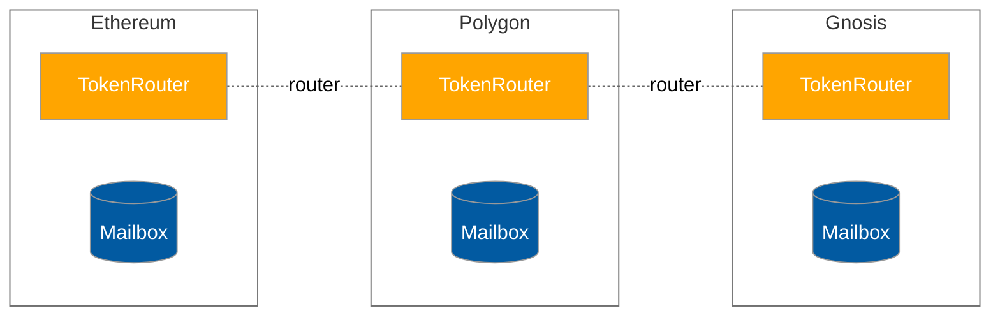
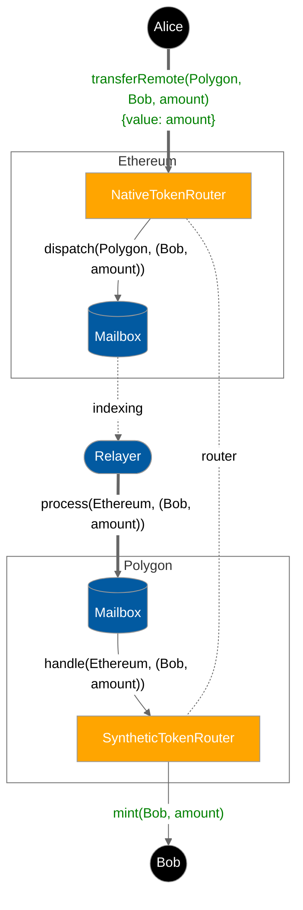
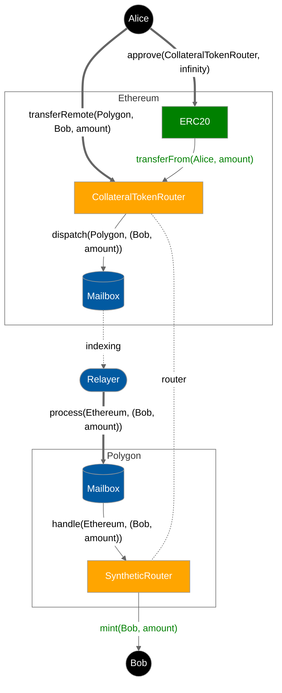
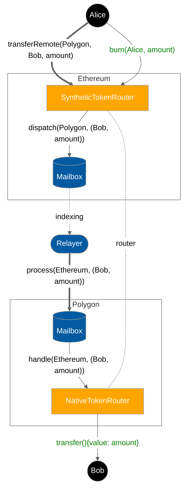

# Hyperlane Warp Routes

This repo contains contracts, deployment, and SDK tooling for Hyperlane Warp Routes. 

## Warp Route Architecture

A *warp route* is a collection of [`TokenRouter`](./contracts/libs/TokenRouter.sol) contracts deployed across a set of Hyperlane chains. These contracts leverage the `Router` pattern to implement access control and routing logic for remote token transfers. These contracts send and receive [`Message`](./contracts/libs/Message.sol)s which encode payloads containing a transfer `amount` and `recipient` address.



The Token Router contract comes in several flavors and a warp route can be composed of a combination of these flavors.

- [`Native`](./contracts/HypNative.sol) - for warping native assets (e.g. ETH) from the canonical chain
- [`Collateral`](./contracts/HypERC20Collateral.sol) - for warping tokens, ERC20 or ERC721, from the canonical chain
- [`Synthetic`](./contracts/HypERC20.sol) - for representing tokens, Native/ERC20 or ERC721, on a non-canonical chain

## Interchain Security Models

Warp routes are unique amongst token bridging solutions because they provide modular security. Because the `TokenRouter` implements the `IMessageRecipient` interface, it can be configured with a custom interchain security module. Please refer to the relevant guide to specifying interchain security modules on the [Messaging API receive docs](https://docs.hyperlane.xyz/docs/apis/messaging-api/receive#interchain-security-modules).

## Remote Transfer Lifecycle Diagrams

To initiate a remote transfer, users call the `TokenRouter.transferRemote` function with the `destination` chain ID, `recipient` address, and transfer `amount`. 

```solidity
interface TokenRouter {
  function transferRemote(
      uint32 destination,
      bytes32 recipient,
      uint256 amount
  ) public returns (bytes32 messageId);
}
```

**NOTE:** The [Relayer](https://docs.hyperlane.xyz/docs/protocol/agents/relayer) shown below must be compensated. Please refer to the relevant guide on [paying for interchain gas](https://docs.hyperlane.xyz/docs/build-with-hyperlane/guides/paying-for-interchain-gas) on the `messageID` returned from the `transferRemote` call.

Depending on the flavor of TokenRouter on the source and destination chain, this flow looks slightly different. The following diagrams illustrate these differences.

### Transfer Alice's `amount` native ETH from Ethereum to Bob on Polygon




### Transfer Alice's ERC20 `amount` from Ethereum to Bob on Polygon



### Transfer Alice's `amount` synthetic MATIC from Ethereum back to Bob as native MATIC on Polygon



**NOTE:** ERC721 collateral variants are assumed to [enumerable](https://docs.openzeppelin.com/contracts/4.x/api/token/erc721#IERC721Enumerable) and [metadata](https://docs.openzeppelin.com/contracts/4.x/api/token/erc721#IERC721Metadata) compliant.

## Versions

| Git Ref | Release Date | Notes |
| ------- | ------------ | ----- |
| [audit-v2-remediation]() | 2023-02-15 | Hyperlane V2 Audit remediation |
| [main]() | ~ | Bleeding edge |


## Setup for local development

```sh
# Install dependencies
yarn

# Build source and generate types
yarn build:dev
```


## Unit testing

```sh
# Run all unit tests
yarn test

# Lint check code
yarn lint
```

## Learn more

For more information, see the [Hyperlane documentation](https://docs.hyperlane.xyz/docs/introduction/readme).

