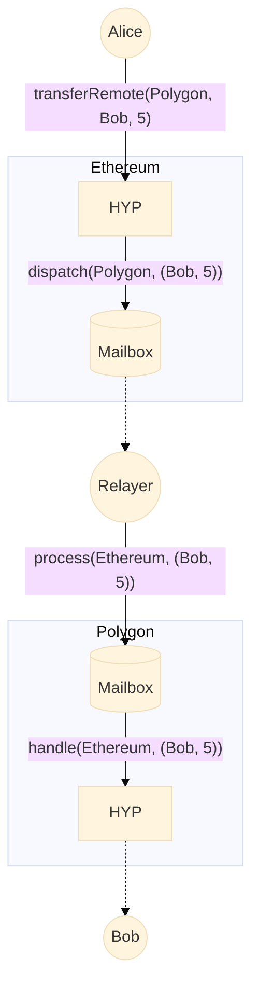

# Hyperlane Warp Route

This repo contains the base Hyperlane ERC20 and ERC721 tokens (HypERC20 and HypERC721). These tokens extend the base standards with an additional `transferRemote` function. Warp Routes are way of arranging these contracts to make existing assets interchain. Read more about Warp Routes and how to deploy your own at [Warp API docs](https://docs.hyperlane.xyz/docs/developers/warp-api).



## Setup for local development

```sh
# Install dependencies
yarn

# Build source and generate types
yarn build:dev
```


## Unit testing

```sh
# Run all unit tests
yarn test

# Lint check code
yarn lint
```

## Learn more

For more information, see the [Hyperlane documentation](https://docs.hyperlane.xyz/hyperlane-docs/developers/getting-started).
