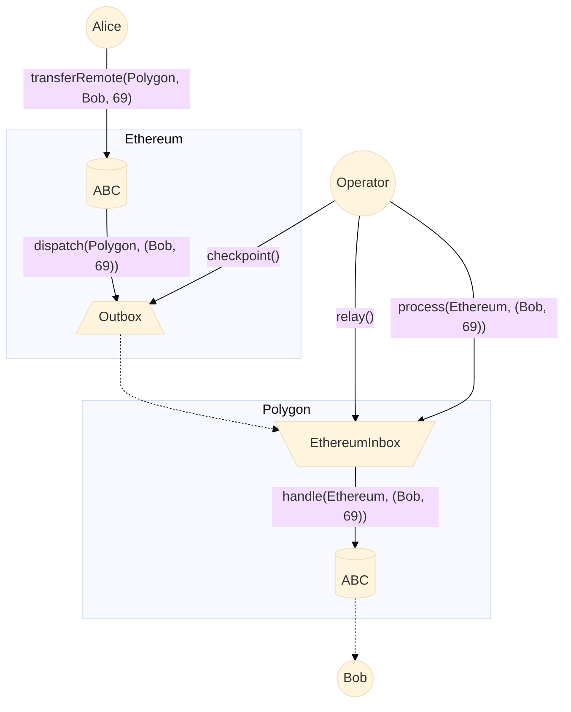

## AbcERC20

`AbcERC20` showcases an Abacus Token that extends the ERC20 token with an additional `transferRemote` function.

## AbcERC721

`AbcERC721` showcases an Abacus Token that extends the ERC721 token with an additional `transferRemote` function.

