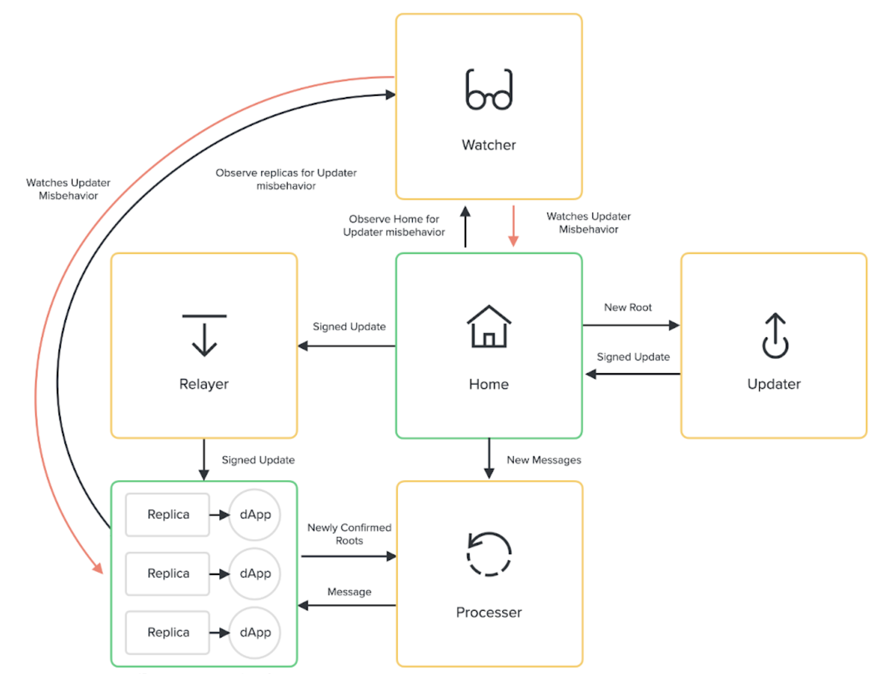

# Optics Architecture

## Components

Optics has several logical components:

- Home - The on-chain contract responsible for producing the message tree
- Replica - The on-chain contract responsible for replicating the message root on some other chain
- Updater - The off-chain participant responsible for submitting updates to the home chain
- Watcher - The off-chain participant responsible for observing a replica, and submitting fraud proofs to the home chain
- Relayer - The off-chain participant responsible for submitting updates to a replica
- Processor - The off-chain participant responsible for causing messages to be processed

### On-chain (Contracts)

#### Home

The home contract is responsible for managing production of the message tree and holding custody of the updater bond. It performs the following functions:

1. Expose a "send message" API to other contracts on the home chain
2. Enforce the message format
3. Commit messages to the message tree
4. Maintain a queue of tree roots
5. Hold the updater bond
6. Slash on double-update proofs (not implemented)
7. Slash on improper update proofs (not implemented)
8. Future: manage updater rotation/bond
9. Future: recover from `FAILED` state

#### Replica

The replica contract is responsible for managing optimistic replication and dispatching messages to end recipients. It performs the following functions:

1. Maintain a queue of pending updates
2. Finalize updates as their timeouts elapse
3. Accept double-update proofs
4. Validate message proofs
5. Enforce the message format
6. Ensure messages are processed in order
7. Dispatch messages to their destination
8. Expose a "disconnect" feature
9. Future: recover from `FAILED` state

### Off-chain (Agents)

#### Updater

The updater is responsible for signing attestations of new roots. It is an off-chain actor that does the following:

1. Observe the home chain contract
2. Sign attestations to new roots
3. Publish the signed attestation to the home chain
4. Future: manage Updater bond

#### Watcher

The watcher observes the Updater's interactions with the Home contract (by watching the Home contract) and reacts to malicious or faulty attestations. It also observes any number of replicas to ensure the Updater does not bypass the Home and go straight to a replica. It is an off-chain actor that does the following:

1. Observe the home
2. Observe 1 or more replicas
3. Maintain a DB of seen updates
4. Submit double-update proofs
5. Submit invalid update proofs
6. If configured, issue an emergency halt transaction 

#### Relayer

The relayer forwards updates from the home to one or more replicas. It is an off-chain actor that does the following:

1. Observe the home
2. Observe 1 or more replicas
3. Polls home for new signed updates (since replica's current root) and submits them to replica
4. Polls replica for confirmable updates (that have passed their optimistic time window) and confirms if available (updating replica's current root)

#### Processor

The processor proves the validity of pending messages and sends them to end recipients. It is an off-chain actor that does the following:

1. Observe the home
2. Generate and submit merkle proofs for pending (unproven) messages
3. Maintain local merkle tree with all leaves
4. Observe 1 or more replicas
5. Maintain list of messages corresponding to each leaf
6. Dispatch proven messages to end recipients
