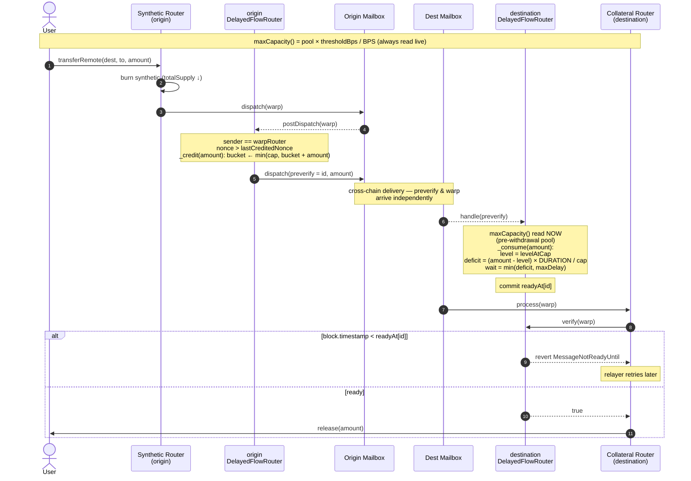

# DelayedFlowRouter

Amount-sensitive hook + ISM that pairs with a warp route to slow cross-chain
withdrawals when net flow on the paired pool exceeds a configurable fraction.
Designed to mitigate bridge-compromise scenarios (e.g. LayerZero rsETH) while
leaving normal, small-amount flow instant.

## Key properties

- **Capacity is live.** `maxCapacity() = pool × thresholdBps / BPS` reads the
  paired warp router's balance (native) / `balanceOf` (collateral) /
  `totalSupply` (synthetic) at call time. Not snapshotted.
- **Refill derives from capacity.** Tokens refill at `maxCapacity / DURATION`
  per second. Subclasses that override `maxCapacity()` get a matching refill
  rate automatically.
- **Delay is sized at preverify.** When the preverify message lands on the
  destination, the bucket is consumed against current pool state. The
  resulting `wait` is clamped to `maxDelay` and written to `readyAt[id]`.
- **`verify` is a pure read.** The ISM never recomputes capacity at verify
  time — `readyAt` was committed at preverify and is immutable from then on.
  First-come-first-served on the bucket, with a bounded UX worst-case.
- **Deposits credit 1:1.** Local outbound dispatches credit the bucket (up to
  `maxCapacity`), preserving net-zero-flow UX for rebalancers and two-way
  fee traffic.

## Lifecycle



## Composing with `PausableIsm`

Ordering matters inside `StaticAggregationIsm`: put `PausableIsm` **before**
`DelayedFlowRouter` so a paused state short-circuits the aggregation with
`Pausable: paused` rather than whatever the delay ISM would surface.

```
modules = [pausable, delayedFlowRouter]
threshold = 2
```

## Sender / recipient binding

- `postDispatch` requires `message.sender == warpRouter` — prevents a third
  party from dispatching an arbitrary message through the Mailbox and
  triggering a credit + preverify against the paired pool's bucket.
- `verify` requires `message.recipient == warpRouter` — prevents verifying
  messages that aren't destined for the paired warp route (e.g. a contract
  that configured us as its ISM).

## Replay protection

`postDispatch` tracks `lastCreditedNonce` (uint32) and requires
`message.nonce > lastCreditedNonce`. Combined with `TimelockRouter`'s
`_isLatestDispatched` check, this prevents the same message from
double-crediting the bucket or re-sending a preverify.
