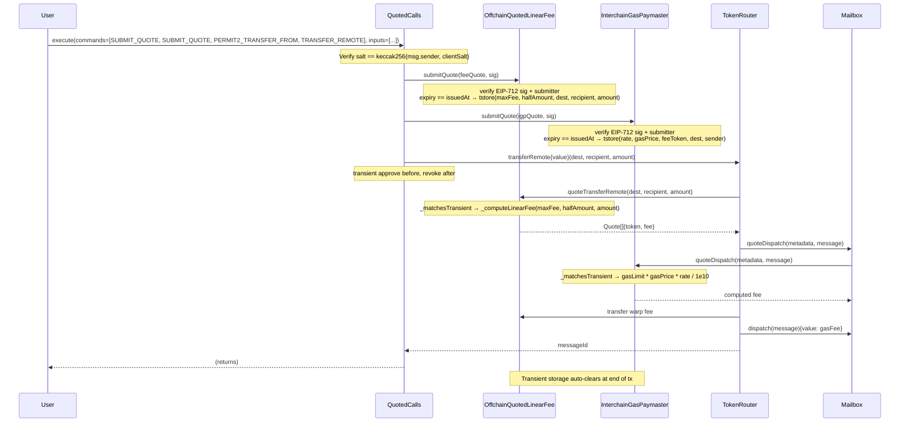
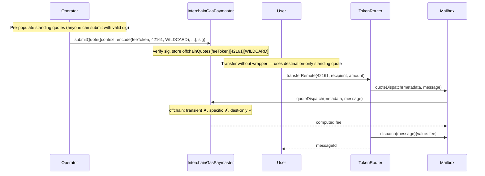

# Real-Time Warp Route Fees via Offchain Quoting

## Context

Current warp route fees use onchain-configured models (Linear, Progressive, Regressive) and StorageGasOracle for IGP. These can't react to real-time market conditions. This leads to overpaying or failed relaying.

**Goal**: Offchain quoting service signs real-time fee quotes; onchain contracts verify signatures and return the authorized quote.

**Key requirements**:

- Differential pricing per user/frontend/partner (entirely offchain logic)
- Independent signatures for IGP and warp fee (separate signers, services, expiry)
- Minimal shared abstract base (sig verification + transient/standing routing)
- Multi-level quote matching with wildcard support via nested mappings
- Individual context field matching (no context hash — fields matched independently)
- Requires Cancun (EIP-1153 transient storage)
- Scoped salt + submitter fields bind quotes to specific callers and contracts
- Command-based execution router with Permit2 and transient approvals

## Signed Quote (EIP-712)

Single unified struct for all quote types, defined in `IOffchainQuoter`:

```solidity
struct SignedQuote {
    bytes context;       // opaque context — decoded by concrete quoter
    bytes data;          // opaque quote payload — decoded by concrete quoter
    uint48 issuedAt;     // signed to enforce update policy (staleness ordering)
    uint48 expiry;       // == issuedAt means transient
    bytes32 salt;        // caller-binding: keccak256(msg.sender, clientSalt)
    address submitter;   // authorized submitter (address(0) = unrestricted)
}
```

**Quote data formats** (`bytes`, contract-specific encoding):

- **IGP**: `abi.encodePacked(uint128 tokenExchangeRate, uint128 gasPrice)` — two uint128 values. Fee = `gasLimit * gasPrice * tokenExchangeRate / 1e10`.
- **Warp fee**: `abi.encodePacked(uint256 maxFee, uint256 halfAmount)` — linear fee params. Fee = `min(maxFee, amount * maxFee / (2 * halfAmount))`. Same formula as `LinearFee`.

**Transient vs standing**:

- **Transient**: `expiry == issuedAt`. Stored via `TransientStorage` library (EIP-1153 tstore/tload). Auto-clears at end of tx. Individual context fields stored for matching.
- **Standing**: `expiry > issuedAt`. Stored in regular storage. Reusable until expiry. Replaced only by newer `issuedAt`.

**Codec layouts**:

IGP quote context (44 bytes packed):

```
[0:20]   Fee token address (address)
[20:24]  Destination domain (uint32)
[24:44]  Sender address (address)
```

IGP quote data (32 bytes packed):

```
[0:16]   Token exchange rate (uint128)
[16:32]  Gas price (uint128)
```

Fee quote context (68 bytes packed):

```
[0:4]    Destination domain (uint32)
[4:36]   Recipient address (bytes32)
[36:68]  Transfer amount (uint256)
```

Fee quote data (64 bytes packed):

```
[0:32]   Maximum fee (uint256)
[32:64]  Half amount — transfer size at which fee = maxFee/2 (uint256)
```

Each concrete contract decodes context to extract mapping keys for standing quotes. Wildcards use `type(T).max`.

**Matched context fields**: Each quoter matches on fields that drive pricing for its domain:

| Field         | Quoter   | Why                                                                                                                      |
| ------------- | -------- | ------------------------------------------------------------------------------------------------------------------------ |
| `destination` | Both     | Gas costs and token exchange rates vary per destination chain.                                                           |
| `feeToken`    | IGP      | IGP supports multiple fee tokens — exchange rate must match the token being paid in. Exact match required (no wildcard). |
| `sender`      | IGP      | Enables per-sender gas pricing (e.g. discounted rates for partners). Wildcard = any sender.                              |
| `recipient`   | Warp fee | Enables per-route pricing (e.g. different fees for different target contracts). Wildcard = any recipient.                |
| `amount`      | Warp fee | Linear fee is amount-dependent (`fee = min(maxFee, amount * maxFee / (2 * halfAmount))`). Wildcard = any amount.         |

**Omitted message fields**: Quote contexts intentionally exclude several Hyperlane message fields:

| Omitted Field       | Reason                                                                                                                                                       |
| ------------------- | ------------------------------------------------------------------------------------------------------------------------------------------------------------ |
| `body`              | Arbitrary application data — too large and unpredictable to sign over. Fee relevance captured by `amount` (warp fee) or `gasLimit` (IGP) instead.            |
| `nonce`             | Sequential per-mailbox. Binding to nonce would make quotes single-use and order-dependent.                                                                   |
| `version`           | Protocol constant — no pricing relevance.                                                                                                                    |
| `origin`            | Quotes are scoped to a single chain's contracts via EIP-712 `verifyingContract` + `chainId`. Origin is implicit.                                             |
| `sender` (warp fee) | Warp fees are priced by route (destination + recipient) and transfer amount, not by who sends. IGP context _does_ include sender for per-sender gas pricing. |
| `recipient` (IGP)   | Gas costs depend on destination chain, not on the recipient contract. Warp fee context _does_ include recipient for per-route pricing.                       |
| `amount` (IGP)      | Gas pricing is amount-independent — fee = `gasLimit * gasPrice * exchangeRate / 1e10`.                                                                       |

**Salt and submitter**:

- `salt` binds quotes to a specific caller. `QuotedCalls` verifies `salt == keccak256(msg.sender, clientSalt)` — the signer commits to the scoped salt in the EIP-712 signature, binding the quote to a specific caller while allowing callers to choose their own salt namespace.
- `submitter` restricts who can call `submitQuote`. If `address(0)`, anyone can submit. If set to `QuotedCalls` address, only that contract can submit.
- ICA command salts are also scoped via `keccak256(msg.sender, userSalt)` before being passed to the ICA router.

**EIP-712 domain separator** uses `(name="OffchainQuoter", version="1", chainId, verifyingContract)` — prevents cross-contract and cross-chain replay.

**Multi-signer support**: `AbstractOffchainQuoter` uses an `EnumerableSet` of signers (ERC-7201 namespaced storage). Owner can add/remove signers via `addQuoteSigner`/`removeQuoteSigner`. Removing a signer does NOT invalidate standing quotes already in storage — they remain resolvable until expiry or overwritten.

## Multi-Level Quote Matching

Each contract uses nested mappings keyed by dimensions decoded from `context`. Wildcards (`type(T).max`) match any value. Transient quotes match individual context fields (not context hash). Resolution checks specific keys first, then wildcards, then fallback.

### IGP (OffchainQuotedIGP → InterchainGasPaymaster)

Offchain quoting is mixed into `InterchainGasPaymaster` via `OffchainQuotedIGP` mixin. The mixin only resolves offchain quotes; the IGP owns the full cascade (offchain → oracle → revert).

```solidity
// Standing quotes (ERC-7201 namespaced):
// offchainQuotes[feeToken][destination][sender]
mapping(address => mapping(uint32 => mapping(address => StoredGasQuote)))

// Transient storage (named slot constants + TransientStorage library):
bytes32 constant TRANSIENT_QUOTED_SLOT = keccak256("OffchainQuotedIGP.quoted");
bytes32 constant TRANSIENT_EXCHANGE_RATE_SLOT = keccak256("OffchainQuotedIGP.exchangeRate");
bytes32 constant TRANSIENT_GAS_PRICE_SLOT = keccak256("OffchainQuotedIGP.gasPrice");
bytes32 constant TRANSIENT_FEE_TOKEN_SLOT = keccak256("OffchainQuotedIGP.feeToken");
bytes32 constant TRANSIENT_DESTINATION_SLOT = keccak256("OffchainQuotedIGP.destination");
bytes32 constant TRANSIENT_SENDER_SLOT = keccak256("OffchainQuotedIGP.sender");
```

| Priority | Lookup                                                     | Semantics                              |
| -------- | ---------------------------------------------------------- | -------------------------------------- |
| 1        | transient (field-level matching via `_matchesTransient`)   | Real-time quote, tx-scoped             |
| 2        | `offchainQuotes[feeToken][destination][sender]`            | Specific token-destination-sender rate |
| 3        | `offchainQuotes[feeToken][destination][WILDCARD_SENDER]`   | Destination-only rate (any sender)     |
| 4        | `offchainQuotes[feeToken][WILDCARD_DEST][sender]`          | Sender-only rate (any destination)     |
| 5        | `tokenGasOracles[feeToken][destination]` (on-chain oracle) | Existing IGP/StorageGasOracle fallback |
| 6        | revert with domain-specific error                          | No oracle configured                   |

### Warp Fee (OffchainQuotedLinearFee)

Inherits `LinearFee` (which inherits `BaseFee`) — immutable `maxFee`/`halfAmount` serve as fallback when no offchain quote matches.

```solidity
// Standing quotes:
// quotes[destination][recipient]
mapping(uint32 => mapping(bytes32 => StoredQuote))

// Transient storage (named slot constants + TransientStorage library):
bytes32 constant TRANSIENT_QUOTED_SLOT = keccak256("OffchainQuotedLinearFee.quoted");
bytes32 constant TRANSIENT_MAX_FEE_SLOT = keccak256("OffchainQuotedLinearFee.maxFee");
bytes32 constant TRANSIENT_HALF_AMOUNT_SLOT = keccak256("OffchainQuotedLinearFee.halfAmount");
bytes32 constant TRANSIENT_DESTINATION_SLOT = keccak256("OffchainQuotedLinearFee.destination");
bytes32 constant TRANSIENT_RECIPIENT_SLOT = keccak256("OffchainQuotedLinearFee.recipient");
bytes32 constant TRANSIENT_AMOUNT_SLOT = keccak256("OffchainQuotedLinearFee.amount");
```

| Priority | Lookup                                                   | Semantics                               |
| -------- | -------------------------------------------------------- | --------------------------------------- |
| 1        | transient (field-level matching via `_matchesTransient`) | Real-time quote, tx-scoped              |
| 2        | `quotes[destination][recipient]`                         | Specific destination-recipient rate     |
| 3        | `quotes[destination][WILDCARD]`                          | Destination-only rate (any recipient)   |
| 4        | `quotes[WILDCARD][recipient]`                            | Recipient-only rate (any destination)   |
| 5        | immutable `maxFee`/`halfAmount`                          | LinearFee fallback (constructor config) |

### Properties

- **No replay protection needed** — transient quotes auto-clear (EIP-1153), standing quotes are intentionally reusable
- **Intra-tx transient reuse is acceptable** — a transient quote can satisfy multiple calls with the same context tuple within one transaction. The quote's scoped `salt` binds it to a specific `msg.sender`, the `submitter` field restricts submission to a specific contract, and context fields must match. Same authorized user reusing the same rate for the same route in the same tx.
- **Field-level matching** — transient quotes match individual context fields, supporting wildcards per-field
- **Graceful degradation** — falls back through specificity levels to oracle / immutable config
- **Compound matching** — Alice-to-Arbitrum, Alice-to-any, anyone-to-Arbitrum all coexist
- **Scoped salt binding** — QuotedCalls verifies `salt == keccak256(msg.sender, clientSalt)`, preventing unauthorized quote use
- **Submitter restriction** — quotes can be locked to a specific submitter contract
- **Users can transfer without the wrapper** if a matching standing quote or immutable config exists

## Architecture

### Contract Hierarchy

```
IOffchainQuoter (interface + SignedQuote struct)

AbstractOffchainQuoter is IOffchainQuoter (abstract, ERC-7201 namespaced storage)
  ├── EIP-712 signature verification (inline domain separator)
  ├── Multi-signer support (EnumerableSet)
  ├── submitQuote() — verifies sig + expiry + submitter, routes transient vs standing
  ├── abstract _storeTransient() / _storeStanding()
  └── QuoteSubmitted event

TransientStorage (library, using for bytes32)
  ├── store(bytes32 slot, uint256|address|bytes32) — tstore wrappers
  ├── set(bytes32 slot) / clear(bytes32 slot) — flag operations
  └── loadUint256/loadBool/loadAddress/loadBytes32/loadUint128/loadUint32 — tload wrappers

OffchainQuotedIGP is AbstractOffchainQuoter
  ├── offchainQuotes[feeToken][destination][sender] (ERC-7201 namespaced)
  ├── Named transient storage slots via TransientStorage library
  ├── _resolveOffchainQuote() → returns (found, rate, gasPrice)
  ├── _matchesTransient() — field-level wildcard matching
  ├── IGPQuoteContext / IGPQuoteData libraries for encoding/decoding
  └── Does NOT know about on-chain oracles (clean separation)

InterchainGasPaymaster is OffchainQuotedIGP, AbstractPostDispatchHook, ...
  ├── _resolveExchangeRateAndGasPrice() → offchain quote → oracle fallback
  ├── _getExchangeRateAndGasPrice() → tokenGasOracles (with require)
  ├── addQuoteSigner() / removeQuoteSigner() — owner-gated
  └── Existing IGP functionality preserved (claim, payForGas, oracles, etc.)

LinearFee is BaseFee
  ├── _computeLinearFee(maxFee, halfAmount, amount) — reusable math
  └── Immutable maxFee / halfAmount from BaseFee constructor

OffchainQuotedLinearFee is AbstractOffchainQuoter, LinearFee
  ├── quotes[destination][recipient] nested mapping
  ├── Named transient storage slots via TransientStorage library
  ├── quoteTransferRemote() → offchain cascade → immutable LinearFee fallback
  ├── _matchesTransient() — field-level wildcard matching
  ├── addQuoteSigner() / removeQuoteSigner() — owner-gated
  └── Inherits claim(), token, receive() from BaseFee

QuotedCalls is PackageVersioned
  ├── Command-based router: execute(bytes commands, bytes[] inputs)
  ├── Typed commands: SUBMIT_QUOTE, PERMIT2_PERMIT, PERMIT2_TRANSFER_FROM,
  │   TRANSFER_REMOTE, TRANSFER_REMOTE_TO, CALL_REMOTE_WITH_OVERRIDES,
  │   CALL_REMOTE_COMMIT_REVEAL, SWEEP
  ├── Scoped salt: keccak256(msg.sender, clientSalt) for quotes and ICA salts
  ├── Permit2 for token inflows (no standing approvals)
  ├── Persistent approve pattern for outflows (gas-efficient, safe: whitelisted ops only)
  ├── Native value forwarding (TRANSFER_REMOTE, TRANSFER_REMOTE_TO, CALL_REMOTE_*)
  ├── EOA guard on PERMIT2_TRANSFER_FROM (code.length check)
  └── CONTRACT_BALANCE sentinel for balance-relative amounts (ERC20 + native ETH)
```

### `QuotedCalls`

Command-based router (UniversalRouter pattern) that atomically submits offchain-signed quotes and executes Hyperlane operations. Uses `execute(bytes commands, bytes[] inputs)` where each command byte maps to a typed operation.

```solidity
uint256 constant SUBMIT_QUOTE = 0x00;               // Submit offchain quote to quoter
uint256 constant PERMIT2_PERMIT = 0x01;              // Set Permit2 allowance via signature
uint256 constant PERMIT2_TRANSFER_FROM = 0x02;       // Pull tokens (ERC20 fallback → Permit2)
uint256 constant TRANSFER_REMOTE = 0x03;             // Warp route transfer + value forwarding
uint256 constant TRANSFER_REMOTE_TO = 0x04;          // Cross-collateral transfer + value forwarding
uint256 constant CALL_REMOTE_WITH_OVERRIDES = 0x05;  // ICA call + scoped salt
uint256 constant CALL_REMOTE_COMMIT_REVEAL = 0x06;   // ICA commit-reveal + scoped salt
uint256 constant SWEEP = 0x07;                       // Return remaining ERC20 + ETH to sender

function execute(bytes calldata commands, bytes[] calldata inputs) external payable;
```

**Safety invariant**: users may hold standing ERC-20 approvals to this contract (used by the `transferFrom` fallback in `PERMIT2_TRANSFER_FROM`). These approvals are safe because only whitelisted Hyperlane operations are callable — there is no arbitrary external call command that could invoke `token.transferFrom(victim, attacker, amount)`. No reentrancy guard is needed: whitelisted operations (e.g. `transferRemote`) pull tokens from `msg.sender` into the target contract, never from QuotedCalls' balance, so a reentering caller with a malicious target cannot drain tokens belonging to another user.

**Token safety**:

- **Inflows**: Permit2 signatures or standing ERC-20 approvals to this contract (`PERMIT2_TRANSFER_FROM` tries `transferFrom` first, falls back to Permit2). Standing approvals are safe because no arbitrary call command exists — only whitelisted Hyperlane operations. `PERMIT2_TRANSFER_FROM` checks `token.code.length > 0` before the low-level call to prevent EOAs from silently skipping the Permit2 fallback.
- **Outflows**: Persistent approvals — each `TRANSFER_REMOTE` / `TRANSFER_REMOTE_TO` / `CALL_REMOTE_*` sets approval before the call. No standalone APPROVE command exists. Persistent approvals are gas-efficient (avoids zero→non-zero SSTORE on repeat routes) and safe because only whitelisted operations are callable and the contract holds no tokens between transactions.
- **Value forwarding**: `TRANSFER_REMOTE`, `TRANSFER_REMOTE_TO`, and `CALL_REMOTE_*` accept a `value` field for native ETH forwarding. Supports `CONTRACT_BALANCE` sentinel.
- **Sweeps**: `SWEEP` returns remaining ERC20 (if token != address(0)) and ETH to `msg.sender`.
- **`CONTRACT_BALANCE` sentinel**: `0x80...00` resolves to the contract's balance — ERC20 `balanceOf(this)` for token amounts, `address(this).balance` for native value.

### Cross-Collateral Support

`QuotedCalls` supports `TRANSFER_REMOTE_TO` for cross-collateral transfers. The `CrossCollateralRoutingFee` maps `(destination, targetRouter) → feeContract`, enabling independent fee pricing per target router. Each fee contract can be a separate `OffchainQuotedLinearFee` instance with its own signers and rates.

## Sequence Diagrams

### Transfer with Transient Quote via QuotedCalls



### Transfer with Standing Quote (No Wrapper Needed)



## Deployment

1. Call `addQuoteSigner(signer)` on existing `InterchainGasPaymaster`
2. Deploy `OffchainQuotedLinearFee(signer, feeToken, maxFee, halfAmount, owner)`
3. `warpRoute.setFeeRecipient(address(quotedLinearFee))`
4. Pre-populate standing quotes for known routes (optional)
5. Deploy `QuotedCalls(permit2Address)` for transient quote UX (optional)

For cross-collateral:

6. Deploy `CrossCollateralRoutingFee(owner)`
7. `routingFee.setCrossCollateralRouterFeeContracts(dests, targetRouters, feeContracts)` — each fee contract can be a different `OffchainQuotedLinearFee`
8. `crossCollateralRouter.setFeeRecipient(address(routingFee))`

Existing warp routes can adopt offchain quoting by setting the new fee recipient — no redeployment of the warp route or IGP needed.

## Security Properties

| Property                  | Mechanism                                                                                                |
| ------------------------- | -------------------------------------------------------------------------------------------------------- |
| Cross-contract replay     | EIP-712 domain separator includes `verifyingContract`                                                    |
| Cross-chain replay        | EIP-712 domain separator includes `chainId`                                                              |
| Transient isolation       | EIP-1153 transient storage — tx-scoped, invisible to other txs                                           |
| Field-level matching      | Individual context fields matched (not hash) — supports per-field wildcards                              |
| Fee token binding (IGP)   | Context includes `feeToken` — exact match required, prevents cross-token reuse                           |
| Quote expiry              | `uint48(block.timestamp) <= expiry` check on submission                                                  |
| Multi-signer auth         | `EnumerableSet` of signers, `ECDSA.recover` against set                                                  |
| Signer removal caveat     | Removing a signer does NOT invalidate standing quotes already in storage                                 |
| Staleness prevention      | `issuedAt` must be > existing to replace standing quotes (signed field)                                  |
| Scoped salt binding       | `QuotedCalls` verifies `salt == keccak256(msg.sender, clientSalt)`                                       |
| ICA salt scoping          | ICA commands derive `keccak256(msg.sender, userSalt)` before passing to router                           |
| Submitter restriction     | `submitter` field checked against `msg.sender` on submission                                             |
| Intra-tx transient reuse  | Acceptable — scoped salt + submitter + context field matching ensure same user, same route               |
| Standing approval safety  | Users may approve this contract; safe because only whitelisted ops are callable (no arbitrary calls)     |
| No arbitrary calls        | Typed commands only — prevents attacker from calling `transferFrom(victim, attacker, amount)`            |
| Reentrancy                | No guard needed: whitelisted ops pull from msg.sender not contract balance; targets are caller-specified |
| EOA transfer guard        | `PERMIT2_TRANSFER_FROM` checks `token.code.length > 0` before low-level call                             |
| Approval safety invariant | Outbound approvals safe: whitelisted ops only, no tokens held between txs, targets user-specified        |

## Files

| File                                               | Status   | Description                                |
| -------------------------------------------------- | -------- | ------------------------------------------ |
| `contracts/interfaces/IOffchainQuoter.sol`         | Created  | SignedQuote struct + IOffchainQuoter iface |
| `contracts/libs/AbstractOffchainQuoter.sol`        | Created  | Abstract base — EIP-712 sig, multi-signer  |
| `contracts/libs/TransientStorage.sol`              | Created  | tstore/tload wrappers for compat           |
| `contracts/hooks/igp/OffchainQuotedIGP.sol`        | Created  | IGP offchain quote resolution mixin        |
| `contracts/hooks/igp/InterchainGasPaymaster.sol`   | Modified | Full cascade: offchain → oracle → revert   |
| `contracts/token/fees/OffchainQuotedLinearFee.sol` | Created  | ITokenFee impl, inherits LinearFee         |
| `contracts/token/fees/LinearFee.sol`               | Modified | Made `feeType()` virtual                   |
| `contracts/token/QuotedCalls.sol`                  | Created  | Command-based router with Permit2          |
| `test/token/OffchainQuotedLinearFee.t.sol`         | Created  | Unit tests for OffchainQuotedLinearFee     |
| `test/token/QuotedCalls.t.sol`                     | Created  | Unit tests for QuotedCalls                 |
| `test/token/QuotedCalls.invariant.t.sol`           | Created  | Invariant tests — malicious target fuzzing |
| `test/igps/IGPOffchainQuoting.t.sol`               | Created  | Unit tests for IGP offchain quoting        |
| `test/token/CrossCollateralRouter.t.sol`           | Modified | QuotedCalls + cross-collateral demo test   |
