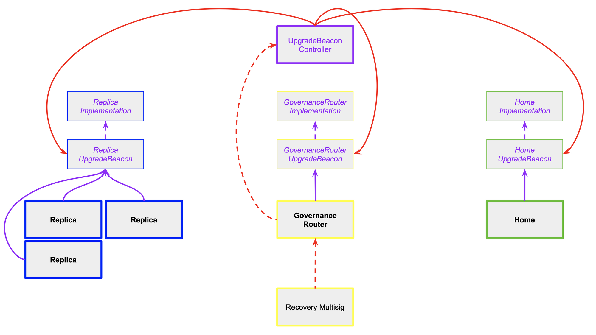
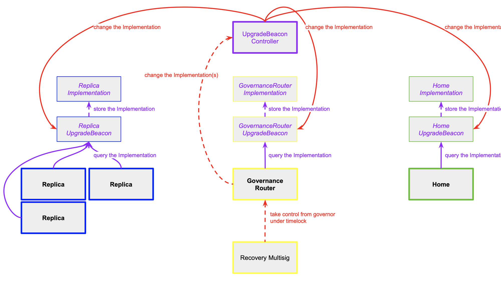
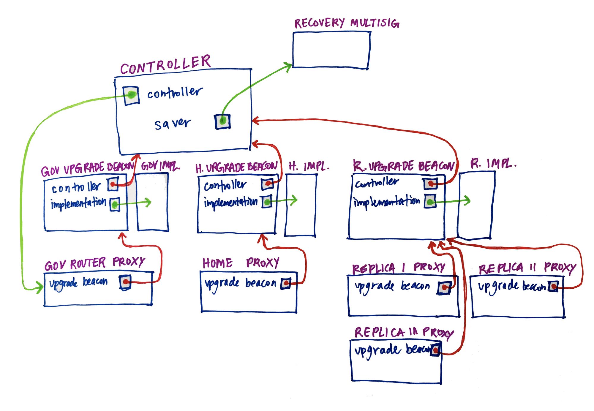

# Upgrade Setup

We will use the `UpgradeBeacon` pattern to implement three upgradable contract types: `Home`, `Replica`, and `GovernanceRouter`.

Each upgradable contract will have:

- **Proxy**
  - the permanent address of the contract that external entities interact with
  - holds the storage of the contract
  - uses the logic specified by `Implementation`
  - uses `delegatecall` to forward contract calls from `Proxy` → `UpgradeBeacon` → `Implementation`
- **UpgradeBeacon**
  - stores the (mutable) address of the `Implementation`
  - forwards `delegatecalls` to the `Implementation`
  - accepts new `Implementation` addresses from its `Controller` (thereby performing upgrades for all `Proxies`)
- **Implementation**
  - specifies the logic of the contract
  - code is the same as a normal, non-upgradable contract implementation (though it should use upgrade-safe storage)

Each of the three `UpgradeBeacon` contracts will share a the same `Controller` — the contract with the power to perform upgrades.

The **Controller** contract will have two roles: controller and saver.

- `controller`
  - is a transferrable role that should be performing upgrades in almost every case.
  - will be set to the `GovernanceRouter Proxy`, so that the Governance xApp ultimately controls the upgrades of the entire system. Note that this creates a circular dependency which makes upgrades of the `GovernanceRouter Implementation` particularly sensitive.
- `saver`
  - is a transferrable(?) role that is responsible for recovering the system in a catastrophic failure case. Actions performed by the `saver` will be subject to a timelock enforced by the Controller contract.
  - will be set to a multisig contract where the signatories are a set of known / trusted community members. the signatories for the `saver` multisig be the same on every chain

## Diagrams

## Executing Upgrades: Flow / Process

### Home or Replica

TODO

### Governance Router

TODO (similar to Home or Replica but extra-sensitive b.c. potential to mess up upgradability function)

## Appendix

TODO

### Deprecated Diagram

