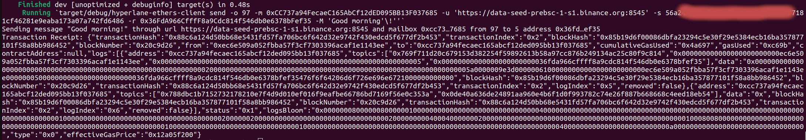
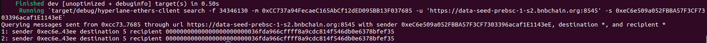

# Hyperlane Ethers Client

`hyperlane-ethers-client` cli application provides functionalities to send or query interchain messages between EVM-compatible blockchains. 

Implementations:

It uses [ethers-rs](https://crates.io/crates/ethers) to interact with the [Mailbox](../../../solidity/contracts/Mailbox.sol) smart contract deployed on the origin chain to [dispatch](https://github.com/hyperlane-xyz/hyperlane-monorepo/blob/main/solidity/contracts/Mailbox.sol#L105) a new message and query through the emitted logs for the [Dispatched](https://github.com/hyperlane-xyz/hyperlane-monorepo/blob/main/solidity/contracts/interfaces/IMailbox.sol#L15) messages.

`abigen!` macro is used to create a new type-safe binding struct, called `Mailbox` based on the [Mailbox.abi.json](https://github.com/hyperlane-xyz/hyperlane-monorepo/blob/main/rust/chains/hyperlane-ethereum/abis/Mailbox.abi.json) file.


## Build

```
~/hyperlane-monorepo/rust$ cargo build --bin hyperlane-ethers-client
```

## Run commands

### Send Message

- Prerequisites:
   - A sender account must be created and funded on the origin chain
   - Origin and detinations domain IDs can be found [here](https://github.com/hyperlane-xyz/hyperlane-monorepo/blob/main/typescript/sdk/src/consts/chainMetadata.ts). 
   - Origin domain url has to be healthy. Check the url status from the official website and use a healthy one. For example, links for bsc testnet are listed [here](https://chainlist.org/chain/97).
  
- Documentation:
  ```
   Running `target/debug/hyperlane-ethers-client send --help`
    Send a message from an origin chain to a recipient address that is located in a destination chain

    Usage: hyperlane-ethers-client send [OPTIONS] --mailbox <MAILBOX> --url <URL> --sender-private-key <SENDER_PRIVATE_KEY> --recipient <RECIPIENT>

    Options:
    -o, --origin <ORIGIN>
            Origin chain id, default is goerli chain id [default: 5]
    -m, --mailbox <MAILBOX>
            Mailbox smart contract address
    -u, --url <URL>
            Chain url
    -d, --destination <DESTINATION>
            Destination chain id, default is goerli chain id [default: 5]
    -s, --sender-private-key <SENDER_PRIVATE_KEY>
            Sender private key, do not include '0x' at the start of the private key
    -r, --recipient <RECIPIENT>
            Recipient address
    -M, --message <MESSAGE>
            Message to be sent [default: "Hello, World!"]
    -h, --help
            Print help
  ```

- Example:
  ```  
  ~/hyperlane-monorepo/rust$ cargo run --bin hyperlane-ethers-client -- send \
  > -o 97 \
  > -m 0xCC737a94FecaeC165AbCf12dED095BB13F037685 \
  > -u https://data-seed-prebsc-1-s1.binance.org:8545 \
  > -s 56a24f69..........7a742fd6486 \
  > -r 0x36FdA966CfffF8a9Cdc814f546db0e6378bFef35 \
  > -M 'Good morning!'
  ```

  Result:
  
  
  
### Search Message

- Prerequisites:
   - Origin domain url has to be healthy can be found [here](https://github.com/hyperlane-xyz/hyperlane-monorepo/blob/main/typescript/sdk/src/consts/chainMetadata.ts). 
  
- Documentation:
  ```
   Running `target/debug/hyperlane-ethers-client search --help`
    Search for messages that has been sent from an origin chain

    Usage: hyperlane-ethers-client search [OPTIONS] --mailbox <MAILBOX> --url <URL>

    Options:
    -m, --mailbox <MAILBOX>          Mailbox smart contract address
    -u, --url <URL>                  Chain url
    -f, --from-block <FROM_BLOCK>    From block number [default: 0]
    -t, --to-block <TO_BLOCK>        To block number [default: *]
    -s, --sender <SENDER>            Recipient addresses [default: *]
    -d, --destination <DESTINATION>  Destination chain id [default: *]
    -r, --recipient <RECIPIENT>      Recipient addresses [default: *]
    -h, --help                       Print help
  ```

- Example:
  ```  
  ~/hyperlane-monorepo/rust$ cargo run --bin hyperlane-ethers-client -- search \
  > -f 34346130 \
  > -m 0xCC737a94FecaeC165AbCf12dED095BB13F037685 \
  > -u https://data-seed-prebsc-1-s1.binance.org:8545 \
  > -s 0xeC6e509a052FBBA57F3CF7303396acaf1E1143eE
  ```
  Result:
  
  