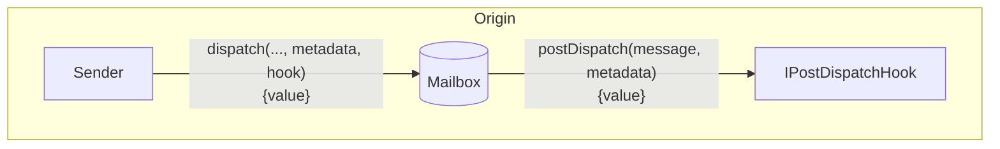
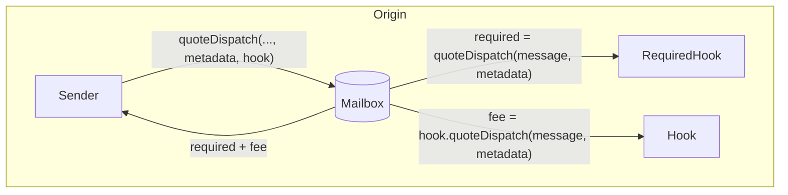
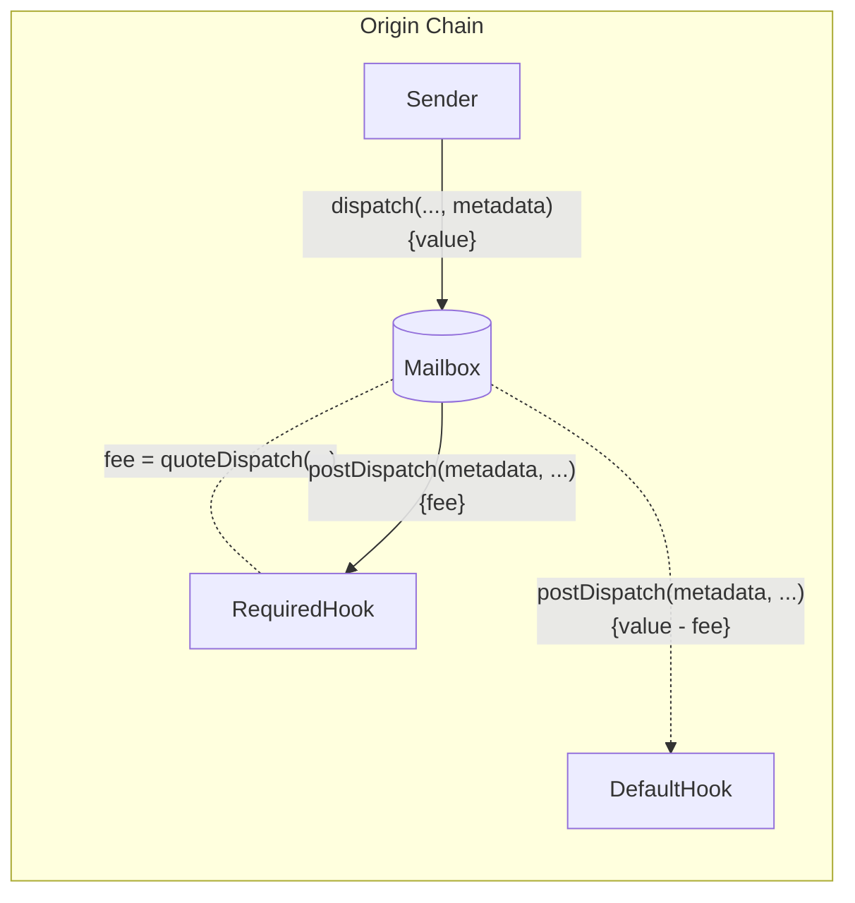

# Post-Dispatch Hooks

Post-dispatch hooks allow developers to configure additional origin chain behavior with message content dispatched via the Mailbox.

If the `postDispatch` function receives insufficient payment, it may revert.

> [!WARNING]
> Post-Dispatch Hooks may be replayable. Developers creating custom hooks should implement safe checks to prevent this behavior. [Here](./warp-route/RateLimitedHook.sol#L16) is an example implementation.

### Quote Dispatch (Fees)

Fees are often charged in `postDispatch` to cover costs such as destination chain transaction submission and security provisioning. To receive a quote for a corresponding `postDispatch` call, you can query the `quoteDispatch` function.

The Mailbox has a `quoteDispatch` function that returns the aggregate fee required for a `dispatch` call to be successful.

The custom `metadata` will be passed to the required hook's `quoteDispatch` and `postDispatch` functions, before being passed to the default hook's `postDispatch` function.

