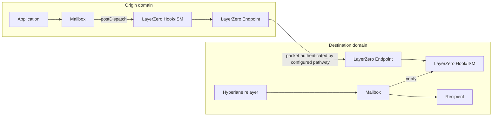
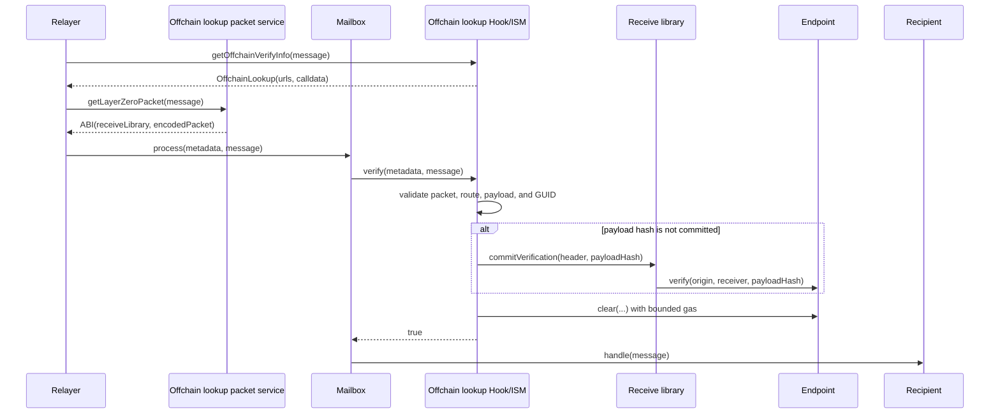

# LayerZero V2 Hook/ISM

The LayerZero V2 Hook/ISM uses a configured LayerZero pathway to authenticate
Hyperlane messages. A deployment is both:

- an origin post-dispatch hook that sends the Hyperlane message ID through
  LayerZero; and
- a destination interchain security module (ISM) that requires LayerZero to
  authenticate that same message ID.

Each local deployment can serve multiple enrolled remote domains. Applications
can share one deployment when they accept its owner, peer set, LayerZero
libraries, DVN configuration, and operational blast radius. Separate
deployments provide independent policy and ownership.

[`LayerZeroV2OffchainLookupHookIsm`](./LayerZeroV2OffchainLookupHookIsm.sol) verifies a
LayerZero packet during `Mailbox.process`. Its ISM metadata ABI-encodes
`(address receiveLibrary, bytes encodedPacket)`.

The Hyperlane delivery transaction can commit a packet after the configured
DVNs attest. Verification requires an offchain lookup packet service, but does not
wait for LayerZero Executor delivery. The Hyperlane relayer cannot replace the
DVNs' attestations.

## LayerZero terms used here

An [Endpoint V2](https://docs.layerzero.network/v2/developers/evm/protocol-contracts-overview)
is LayerZero's on-chain entry point on each chain. An endpoint ID identifies a
LayerZero chain; it is distinct from a Hyperlane domain ID. This hook/ISM is the
LayerZero application (OApp) on both sides of a pathway.

For a message from A to B:

1. A's Endpoint uses the selected
   [send library](https://docs.layerzero.network/v2/concepts/protocol/message-send-library)
   to encode the packet, quote the fee, and assign work to the configured DVNs
   and Executor. `sendConfig` holds that library's outbound Executor and DVN
   settings for B's endpoint ID.
2. DVNs submit packet attestations to B's selected
   [receive library](https://docs.layerzero.network/v2/concepts/protocol/message-receive-library).
   `receiveConfig` holds its inbound DVN and confirmation requirements for A's
   endpoint ID. Once those requirements are met, anyone can call the receive
   library's `commitVerification`; it records the packet's payload hash in B's
   Endpoint.
3. A configured Executor normally submits the verified packet to
   `Endpoint.lzReceive`, but the Endpoint does not restrict that call to the
   configured Executor; anyone can submit it. Here, the Hyperlane relayer
   instead supplies the packet during `Mailbox.process`. The ISM checks the exact
   packet and commits verification if needed. Executor delivery is not
   required for Hyperlane processing.

Selecting a library and setting its configuration are different Endpoint
operations. A library address chooses the implementation for this OApp and
remote endpoint ID; `setConfig` supplies that library's worker policy. Empty
config arrays use the selected ULN302 libraries' defaults. The owner must check
that the send policy on A and receive policy on B are compatible. See LayerZero's
[pathway configuration guide](https://docs.layerzero.network/v2/get-started/create-lz-oapp/configuring-pathways).

This pull verifier decodes Endpoint V2 PacketV1 data and calls
`IReceiveUlnE2.commitVerification` for packets not already committed. Select
compatible message libraries; Endpoint registration alone does not establish
that a receive library supports this interface.

## Hyperlane integration

The origin Mailbox normally invokes the deployment as a post-dispatch hook. The
hook sends a versioned payload containing the Hyperlane origin, destination,
and message ID through the local LayerZero Endpoint. On the destination, the
recipient selects the corresponding deployment as its ISM, directly or through
a routing or aggregation ISM.



The LayerZero packet carries only an authentication payload. It does not carry
the full Hyperlane message and does not call the Hyperlane recipient. A
Hyperlane relayer must still submit the original message to `Mailbox.process`.

The payload is defined by
[`LayerZeroMessage.sol`](../../libs/LayerZeroMessage.sol) and ABI-encodes:

```text
version = 1
Hyperlane origin domain
Hyperlane destination domain
Hyperlane message ID
```

The message ID commits to the complete packed Hyperlane message, including its
nonce, sender, recipient, body, origin, and destination. Verification requires
the exact enrolled LayerZero peer and endpoint ID for that origin.

For traffic from A to B, configure both sides:

1. A's hook tree invokes A's LayerZero deployment.
2. A enrolls B's LayerZero deployment as the destination peer.
3. B's recipient selects B's deployment in its ISM policy.
4. B enrolls A's LayerZero deployment as the authenticated origin peer.
5. Both LayerZero pathways use the intended libraries, DVNs, confirmations,
   and Executor configuration.

The Mailbox runs its required hook and either the caller-selected or default
hook. Invoking the same LayerZero deployment twice for one dispatch causes the
second call to revert with `LayerZeroAuthorizationAlreadySent` and rolls back
the dispatch.

`postDispatch` is permissionless, but it accepts only the Mailbox's latest
dispatched message and only once per message ID. This permits recovery when the
hook was omitted from a dispatch, while the message remains the latest
dispatch. Normal integrations should invoke the hook atomically during
dispatch instead of depending on this timing-sensitive recovery path.

## Offchain lookup verification

The ISM obtains the exact encoded LayerZero packet through EIP-3668
offchain lookup. A compatible service implements
`getLayerZeroPacket(bytes hyperlaneMessage)` and returns the ABI encoding of:

```solidity
(address receiveLibrary, bytes encodedPacket)
```

The configured URL is a discovery and transport service. It is not trusted for
authenticity. The contract rejects noncanonical metadata, packets over 4096
bytes, malformed packet encoding, and mismatches in every authenticated field.



The Endpoint may already hold a packet's DVN-verified payload hash before
Hyperlane delivery. In that case, `verify` compares the stored hash with this
packet's hash and does not call the receive library again. A packet committed
before a receive-library rotation therefore remains valid even if its old
library is no longer selected. ULN302 deletes the DVN attestations used for a
commitment, so a second `commitVerification` call without fresh attestations
reverts. Checking the stored hash avoids that call. If the Endpoint has no
hash, `verify` requires the metadata-supplied receive library to be currently
valid and asks it to commit verification. A different stored hash reverts with
`ConflictingPayloadHash`.

The hook sends a one-gas `lzReceive` option because standard LayerZero
Executors reject missing and zero-gas receive options. Normal Executor callback
delivery cannot complete with that budget. `lzReceive` additionally accepts a
clear only after the corresponding Hyperlane message is delivered, allowing
permissionless post-delivery cleanup without letting an Executor consume an
undelivered authorization.

## Fees

The hook calls `Endpoint.quote` immediately before sending and pays its
reported native fee. The send library calculates that quote using the
configured DVN and Executor fees.

DVNs are independent verifiers that observe packets and submit attestations to
the receive library. Their attestations are not produced by Hyperlane
validators and are not paid by the Hyperlane Mailbox. The LayerZero send fee is
needed because the packet must enter LayerZero's configured security and
delivery system before the destination Endpoint can accept its payload hash.
Paying the fee does not let the sender choose a different DVN threshold or make
an invalid packet pass verification; those rules come from the configured
message libraries and DVN settings.

The quote still includes the minimum one-gas Executor option required for a
standard pathway to quote and send. It may therefore pay an Executor component
even though Hyperlane delivery does not rely on successful Executor execution.

These fees are separate from:

- origin transaction gas;
- Hyperlane relayer or interchain gas payment costs; and
- gas for `Mailbox.process` and recipient execution.

Only native-fee LayerZero Endpoints are supported. The constructor rejects an
Endpoint whose `nativeToken()` is nonzero. Hook metadata with an ERC-20 fee
token or nonzero destination `msg.value` is also rejected. The LayerZero send
always sets `payInLzToken` to false.

`quoteDispatch` is a point-in-time quote. `postDispatch` quotes again, so a fee
increase between the two calls can revert an underpaid dispatch. Excess payment
is returned to the hook metadata's refund address, or the Hyperlane sender when
no explicit refund address is supplied. A refund failure reverts the dispatch.

All children of a hook aggregation receive the same metadata. An aggregation
containing this native-only hook cannot simultaneously use a nonzero ERC-20 fee
token for another child.

## Route and Endpoint configuration

Construction fixes three values permanently: the Hyperlane Mailbox, LayerZero
Endpoint, and local endpoint ID. Constructor checks confirm that the Endpoint
has code, reports a nonzero endpoint ID, and uses the native currency fee model.
These checks do not prove that the configured contracts and identifiers are
canonical for the chain; the deployer must verify them.

Rich enrollment configures a route atomically with:

- Hyperlane remote domain;
- exact remote Hook/ISM address;
- LayerZero remote endpoint ID;
- explicit send and receive libraries;
- send-library and receive-library configuration entries.

Enrollment rejects the local domain, zero/local endpoint IDs, a zero peer, and
reuse of one endpoint ID by multiple Hyperlane domains. Peers are arbitrary
nonzero `bytes32` values, as LayerZero also supports non-EVM addresses. A route
is accepted only after its send and receive libraries are selected explicitly
for this OApp, rather than inheriting the Endpoint's mutable library defaults.

The inherited basic `Router.enrollRemoteRouter` path is disabled because it
cannot install the required LayerZero policy. Use the typed singular or batch
functions on the concrete contract. Batch operations are atomic.

Calling rich enrollment for an existing domain replaces its route in one
transaction. The contract sets the supplied peer, endpoint ID, libraries, and
policy directly. It writes each supported config type, using the selected
library's default for an omitted entry rather than retaining its old value.
Custom entries support ULN302 Executor (send type 1) and DVN (type 2) settings.
If the endpoint ID changes, the old Endpoint path is blocked and its reverse
lookup removed. No old library config is reset during overwrite: it is inactive
once deselected, and a later selection writes a complete policy. If any step
fails, the old route remains unchanged. A config-only change uses this same
overwrite operation without a between-transaction gap. Packets committed by
the Endpoint remain verifiable if the peer and endpoint ID are unchanged.
Uncommitted packets may no longer verify after a peer, endpoint ID, or
receive-library change. Changing only the receive DVNs or confirmation count
can also strand uncommitted packets: the receive library checks them against
the current policy, even when its address is unchanged.

Endpoint configuration is directional. A to B and B to A may use different
libraries, DVNs, confirmation counts, and Executors. A LayerZero
endpoint ID is not an EVM chain ID or Hyperlane domain:

```text
EVM chain ID != Hyperlane domain != LayerZero endpoint ID
```

Owner compromise is security-critical. The owner can replace trusted peers and
change the libraries and DVN policy used by the Endpoint for this OApp.

## Authentication and trust boundary

Destination authentication checks bind together:

1. the immutable destination Endpoint and local endpoint ID;
2. the enrolled source endpoint ID and exact remote peer;
3. the destination Hook/ISM address in the LayerZero packet;
4. the LayerZero nonce and recomputed GUID;
5. the versioned payload's Hyperlane origin and destination; and
6. the full Hyperlane message ID.

GUID validation hashes the complete 32-byte LayerZero sender, including any
non-EVM address bytes.

| Component | Security role |
| --- | --- |
| LayerZero Endpoint and selected message libraries | Commit and expose authenticated packet state according to the configured pathway |
| Configured DVNs | Attest packets under the configured threshold and confirmation policy |
| Hook/ISM owner | Select peers, endpoint IDs, libraries, DVNs, confirmations, and Executor policy |
| Hyperlane Mailbox | Supplies the canonical message and final replay protection |
| Application configuration | Ensures this hook runs on dispatch and this ISM participates in delivery policy |
| Executor, offchain lookup service, and Hyperlane relayer | Transport data and transactions; can delay or omit work but cannot satisfy packet checks with different data |

A matching LayerZero packet proves that the enrolled remote Hook/ISM sent an
authorization for the exact Hyperlane message ID. It does not prove that the
message's Hyperlane sender is an application the recipient intended to trust.
Recipients must validate `(origin, sender)` in `handle`, as Hyperlane `Router`
does, or enforce an equivalent application/ISM policy.

## Message and route lifecycle

Origin dispatch and LayerZero send are atomic when the Hook/ISM is in the hook
tree. A failed quote, send, or refund reverts the Mailbox dispatch and the
`publishedAuthorizationPackets` write. DVN attestation and destination processing occur
asynchronously.

Route changes affect in-flight messages by stage:

| Stage | Effect of route or receive-policy changes |
| --- | --- |
| Before origin publication | Later sends require the new route |
| Packet sent but not authenticated at destination | Destination checks use the current endpoint ID, peer, library, and DVN/confirmation policy; old packets may no longer authenticate |
| Pull packet awaiting `Mailbox.process` | Verification uses current route identity; old peer or endpoint ID data is rejected |
| Hyperlane message delivered | Mailbox replay protection remains final |

Unenrollment removes the peer and endpoint ID mappings, blocks both Endpoint
directions, and restores the selected libraries' configuration to defaults.

## Pull packet cleanup and LayerZero nonces

LayerZero assigns a `uint64` nonce per source/destination OApp channel.
Returning zero from `nextNonce` opts out of application-level ordered execution;
it does not disable Endpoint nonce accounting. To advance its lazy inbound
nonce, `Endpoint.clear` checks that every intervening nonce has a verified
payload hash. This prevents a clear from skipping an unverified packet, even
though packets can be verified and executed out of order.

After pull verification succeeds, the ISM calls `Endpoint.clear` with a
100,000-gas safety budget. This is our cap, not a LayerZero requirement: a
single-packet clear used 26,610 gas on the production Endpoint at Ethereum fork
block 25,878,200. The [fork test](../../../test/hooks/LayerZeroV2OffchainLookupHookIsm.fork.t.sol)
checks it fits the cap. A longer verified backlog can require more gas, so
cleanup is optimistic: failure emits
`LayerZeroPayloadClearFailed` and does not block the Hyperlane message. This
limits the gas a nonce scan can add to `Mailbox.process`.

`verify` may clear the packet it just authenticated before Mailbox delivery.
It never clears an earlier, undelivered packet merely to advance a LayerZero
nonce. An undelivered message may be blocked by another security module or
application policy, and this ISM cannot safely decide to consume it.

Consequences:

- a successfully verified pull packet may remain in Endpoint storage;
- later clear attempts may repeatedly reach the 100,000-gas limit when the
  Endpoint must scan a large committed nonce prefix; and
- Endpoint storage and cleanup work may accumulate without blocking Hyperlane
  delivery through this ISM.

After the Hyperlane message is delivered, any caller can invoke the normal
LayerZero Endpoint execution path for that exact packet with sufficient gas.
The Endpoint clears first and calls this contract's `lzReceive`; the callback
accepts only delivered message IDs. Operators should monitor failed-clear events
and retry cleanup after confirming Mailbox delivery.

## Observability

| Event | Meaning |
| --- | --- |
| Mailbox `DispatchId` | Origin Mailbox emitted the Hyperlane message ID |
| `LayerZeroAuthorizationSent` | Origin Hook/ISM paid the Endpoint and obtained a GUID and nonce |
| LayerZero Endpoint `PacketSent` | Endpoint emitted the complete encoded packet |
| `LayerZeroPayloadVerified` | ISM matched or committed the exact Endpoint payload hash |
| `LayerZeroPayloadClearFailed` | Pull verification succeeded but bounded cleanup failed |
| Mailbox `ProcessId` | ISM verification and recipient handling completed |
| `LayerZeroRemoteRouterEnrolled` / `LayerZeroRemoteRouterUnenrolled` | Owner changed route identity |
| `LayerZeroSendLibrarySet` / `LayerZeroReceiveLibrarySet` | Owner selected an Endpoint library |
| Library `UlnConfigSet` / `ExecutorConfigSet` | Owner changed pathway worker configuration |

`LayerZeroPayloadVerified` does not report the metadata-supplied receive
library. When a payload hash was committed before processing, that library is
not consulted and is not authenticated event data.

## Operational constraints

- The contract targets Ethereum-protocol chains and Tron with LayerZero V2
  Endpoint support.
- Non-EVM peers require a compatible remote Hook/ISM implementation.
- Only native-fee Endpoints are supported.
- The ISM requires an offchain-lookup-compatible relayer and packet service.
- The contract does not fund Hyperlane relaying; configure an IGP or other
  delivery mechanism separately when needed.
- `Router.handle` is unsupported because LayerZero transports authorization,
  not application message bodies.
