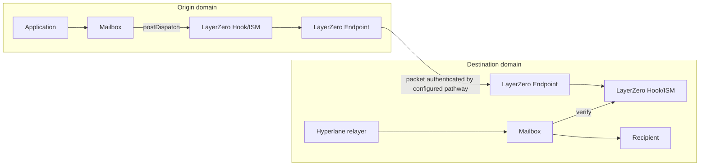
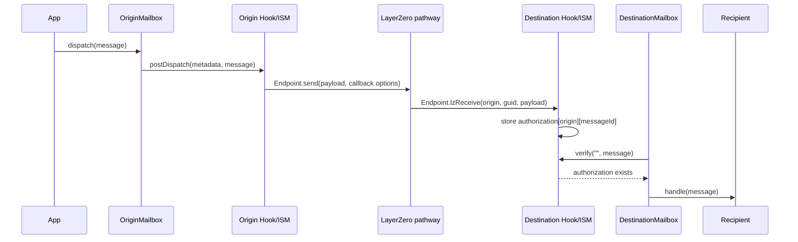
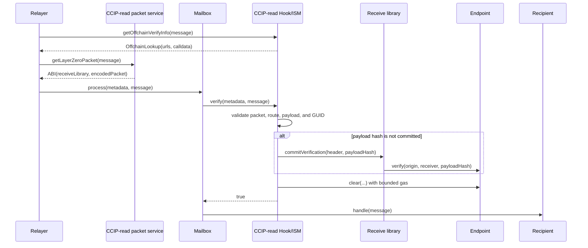

# LayerZero V2 Hook/ISM

The LayerZero V2 Hook/ISM uses a configured LayerZero pathway to authenticate
Hyperlane messages. A deployment is both:

- an origin post-dispatch hook that sends the Hyperlane message ID through
  LayerZero; and
- a destination interchain security module (ISM) that requires LayerZero to
  authenticate that same message ID.

Each local deployment can serve multiple enrolled remote domains. Applications
can share one deployment when they accept its owner, peer set, LayerZero
libraries, DVN configuration, and operational blast radius. Separate
deployments provide independent policy and ownership.

| Contract | Destination authentication | Hyperlane ISM metadata |
| --- | --- | --- |
| [`LayerZeroV2CallbackHookIsm`](./LayerZeroV2CallbackHookIsm.sol) | Endpoint calls `lzReceive` before `Mailbox.process` and the contract stores an authorization | Empty |
| [`LayerZeroV2CcipReadHookIsm`](./LayerZeroV2CcipReadHookIsm.sol) | `Mailbox.process` validates a packet and commits its DVN verification through the receive library | ABI encoding of `(address receiveLibrary, bytes encodedPacket)` |

[`AbstractLayerZeroV2HookIsm`](./AbstractLayerZeroV2HookIsm.sol) contains shared
publication, fee, endpoint, and route configuration logic.

## Hyperlane integration

The origin Mailbox normally invokes the deployment as a post-dispatch hook. The
hook sends a versioned payload containing the Hyperlane origin, destination,
and message ID through the local LayerZero Endpoint. On the destination, the
recipient selects the corresponding deployment as its ISM, directly or through
a routing or aggregation ISM.



The LayerZero packet carries only an authentication payload. It does not carry
the full Hyperlane message and does not call the Hyperlane recipient. A
Hyperlane relayer must still submit the original message to `Mailbox.process`.

The payload is defined by
[`LayerZeroMessage.sol`](../../libs/LayerZeroMessage.sol) and ABI-encodes:

```text
version = 1
Hyperlane origin domain
Hyperlane destination domain
Hyperlane message ID
```

The message ID commits to the complete packed Hyperlane message, including its
nonce, sender, recipient, body, origin, and destination. Both variants require
the exact enrolled LayerZero peer and EID for that origin.

For traffic from A to B, configure both sides:

1. A's hook tree invokes A's LayerZero deployment.
2. A enrolls B's LayerZero deployment as the destination peer.
3. B's recipient selects B's deployment in its ISM policy.
4. B enrolls A's LayerZero deployment as the authenticated origin peer.
5. Both LayerZero pathways use the intended libraries, DVNs, confirmations,
   and Executor configuration.

The Mailbox runs its required hook and either the caller-selected or default
hook. Invoking the same LayerZero deployment twice for one dispatch causes the
second call to revert with `LayerZeroAuthorizationAlreadySent` and rolls back
the dispatch.

`postDispatch` is permissionless, but it accepts only the Mailbox's latest
dispatched message and only once per message ID. This permits recovery when the
hook was omitted from a dispatch, while the message remains the latest
dispatch. Normal integrations should invoke the hook atomically during
dispatch instead of depending on this timing-sensitive recovery path.

## Callback variant

The callback variant asks the LayerZero Executor to call the destination
Endpoint. The Endpoint authenticates and clears the packet, then calls
`LayerZeroV2CallbackHookIsm.lzReceive`. The contract validates the Endpoint,
source EID, peer, payload fields, GUID, and zero destination value before
storing an authorization keyed by `(originDomain, messageId)`.



The callback and Hyperlane delivery are independent transactions. Callback
execution can happen before or after the Hyperlane relayer first attempts
delivery. Until `lzReceive` succeeds, `verify` returns false. Once stored, an
authorization is not consumed by verification; the Mailbox supplies final
message replay protection.

Duplicate authenticated callbacks are idempotent. They rewrite the same boolean
and emit another `LayerZeroAuthorizationReceived` event. Unauthenticated callers
cannot use `lzReceive` directly because only the immutable Endpoint is accepted.

`callbackGasLimits[domain]` funds only the LayerZero callback. It does not fund
`Mailbox.process` or the recipient's `handle` call. The configured value must be
large enough for Endpoint delivery and the authorization write.

## CCIP-read pull variant

The pull variant obtains the exact encoded LayerZero packet through EIP-3668
CCIP-read. A compatible service implements
`getLayerZeroPacket(bytes hyperlaneMessage)` and returns the ABI encoding of:

```solidity
(address receiveLibrary, bytes encodedPacket)
```

The configured URL is a discovery and transport service. It is not trusted for
authenticity. The contract rejects noncanonical metadata, packets over 4096
bytes, malformed packet encoding, and mismatches in every authenticated field.



If the Endpoint already stores the exact payload hash, verification uses that
committed state and does not depend on the metadata's receive-library address.
This preserves packets committed before a receive-library rotation. A different
stored hash reverts with `ConflictingPayloadHash`.

The pull variant sends a one-gas `lzReceive` option because standard LayerZero
Executors reject missing and zero-gas receive options. Normal Executor callback
delivery cannot complete with that budget. `lzReceive` additionally accepts a
clear only after the corresponding Hyperlane message is delivered, allowing
permissionless post-delivery cleanup without letting an Executor consume an
undelivered authorization.

## Fees

Both variants call `Endpoint.quote` immediately before sending and pay its
reported native fee. That quote prices the configured LayerZero pathway. It can
include work performed by the send library, DVNs, and Executor according to the
pathway configuration.

DVNs are independent verifiers that observe packets and submit attestations to
the receive library. Their attestations are not produced by Hyperlane
validators and are not paid by the Hyperlane Mailbox. The LayerZero send fee is
needed because the packet must enter LayerZero's configured security and
delivery system before the destination Endpoint can accept its payload hash.
Paying the fee does not let the sender choose a different DVN threshold or make
an invalid packet pass verification; those rules come from the configured
message libraries and DVN settings.

The callback variant includes a usable Executor gas option, so its quote funds
automatic destination callback delivery. The pull variant still includes the
minimum one-gas Executor option required for a standard pathway to quote and
send. It may therefore pay an Executor component even though Hyperlane delivery
does not rely on successful Executor execution.

These fees are separate from:

- origin transaction gas;
- Hyperlane relayer or interchain gas payment costs; and
- gas for `Mailbox.process` and recipient execution.

Only native-fee LayerZero Endpoints are supported. The constructor rejects an
Endpoint whose `nativeToken()` is nonzero. Hook metadata with an ERC-20 fee
token or nonzero destination `msg.value` is also rejected. The LayerZero send
always sets `payInLzToken` to false.

`quoteDispatch` is a point-in-time quote. `postDispatch` quotes again, so a fee
increase between the two calls can revert an underpaid dispatch. Excess payment
is returned to the hook metadata's refund address, or the Hyperlane sender when
no explicit refund address is supplied. A refund failure reverts the dispatch.

All children of a hook aggregation receive the same metadata. An aggregation
containing this native-only hook cannot simultaneously use a nonzero ERC-20 fee
token for another child.

## Route and Endpoint configuration

Construction fixes three values permanently: the Hyperlane Mailbox, LayerZero
Endpoint, and local EID. Constructor checks confirm that the Endpoint has code,
reports a nonzero EID, and uses the native currency fee model. These checks do
not prove that the configured contracts and identifiers are canonical for the
chain; the deployer must verify them.

Rich enrollment configures a route atomically with:

- Hyperlane remote domain;
- exact remote Hook/ISM address;
- LayerZero remote EID;
- explicit send and receive libraries;
- send-library and receive-library configuration entries;
- receive-library grace period and optional timeout; and
- callback gas limit for the callback variant.

Enrollment rejects the local domain, zero/local EIDs, zero or noncanonical EVM
peer encodings, and reuse of one EID by multiple Hyperlane domains. A route is
accepted only when it uses explicit nondefault send and receive libraries and
has its variant-specific configuration.

The inherited basic `Router.enrollRemoteRouter` path is disabled because it
cannot install the required LayerZero policy. Use the typed singular or batch
functions on the concrete contract. Batch operations are atomic.

`updateLayerZeroRemoteRouterConfig` can replace the peer, update configuration
for the currently selected libraries, change the receive-library timeout, and
change callback gas. It cannot change the route's EID or selected libraries.
Use unenrollment followed by rich enrollment for an EID change. Rich enrollment
can rotate libraries while retaining the EID.

Endpoint configuration is directional. A to B and B to A may use different
libraries, DVNs, confirmation counts, Executors, and timeouts. A LayerZero EID
is not an EVM chain ID or Hyperlane domain:

```text
EVM chain ID != Hyperlane domain != LayerZero EID
```

Owner compromise is security-critical. The owner can replace trusted peers and
change the libraries and DVN policy used by the Endpoint for this OApp.

## Authentication and trust boundary

Destination authentication checks bind together:

1. the immutable destination Endpoint and local EID;
2. the enrolled source EID and exact remote peer;
3. the destination Hook/ISM address in the LayerZero packet;
4. the LayerZero nonce and recomputed GUID;
5. the versioned payload's Hyperlane origin and destination; and
6. the full Hyperlane message ID.

| Component | Security role |
| --- | --- |
| LayerZero Endpoint and selected message libraries | Commit and expose authenticated packet state according to the configured pathway |
| Configured DVNs | Attest packets under the configured threshold and confirmation policy |
| Hook/ISM owner | Select peers, EIDs, libraries, DVNs, confirmations, Executor policy, and callback gas |
| Hyperlane Mailbox | Supplies the canonical message and final replay protection |
| Application configuration | Ensures this hook runs on dispatch and this ISM participates in delivery policy |
| Executor, CCIP-read service, and Hyperlane relayer | Transport data and transactions; can delay or omit work but cannot satisfy packet checks with different data |

A matching LayerZero packet proves that the enrolled remote Hook/ISM sent an
authorization for the exact Hyperlane message ID. It does not prove that the
message's Hyperlane sender is an application the recipient intended to trust.
Recipients must validate `(origin, sender)` in `handle`, as Hyperlane `Router`
does, or enforce an equivalent application/ISM policy.

## Message and route lifecycle

Origin dispatch and LayerZero send are atomic when the Hook/ISM is in the hook
tree. A failed quote, send, or refund reverts the Mailbox dispatch and the
`sent` write. DVN attestation and destination processing occur asynchronously.

Route changes affect in-flight messages by stage:

| Stage | Effect of unenrollment or peer replacement |
| --- | --- |
| Before origin publication | Later sends require the new route |
| Packet sent but not authenticated at destination | Destination checks use the current EID and peer; an old peer no longer authenticates |
| Callback authorization already stored | The exact `(originDomain, messageId)` authorization remains valid |
| Pull packet awaiting `Mailbox.process` | Verification uses current route identity; old peer or EID data is rejected |
| Hyperlane message delivered | Mailbox replay protection remains final |

Callback authorizations deliberately survive unenrollment, peer replacement,
and later Endpoint policy changes. This permits retrying a message already
authenticated under the previous policy. It also means route removal is not a
retroactive revocation mechanism. During an emergency rotation, review stored
`LayerZeroAuthorizationReceived` events and any pending Hyperlane messages.
There is no per-authorization delete or expiry function.

Unenrollment removes the peer, EID mappings, and callback gas configuration. It
does not mutate LayerZero Endpoint library/config storage, because that state is
keyed by the OApp and EID and can be reused if the route is enrolled again.

## Pull packet cleanup and LayerZero nonces

LayerZero assigns a `uint64` nonce per source/destination OApp channel. The
contracts opt out of application-level ordered execution by returning zero from
`nextNonce`, but the Endpoint still records payload hashes and maintains a lazy
inbound nonce.

After pull verification succeeds, the ISM calls `Endpoint.clear` with a fixed
100,000-gas budget. Cleanup is optimistic: failure emits
`LayerZeroPayloadClearFailed` and does not block the Hyperlane message. This
prevents an unbounded Endpoint scan across a long contiguous set of committed
nonces from exhausting `Mailbox.process` gas.

The contract never clears an undelivered Hyperlane message merely to advance a
LayerZero nonce. An undelivered message may be blocked by another security
module or application policy, and this ISM cannot safely decide to consume it.

Consequences:

- a successfully verified pull packet may remain in Endpoint storage;
- later clear attempts may repeatedly reach the 100,000-gas limit when the
  Endpoint must scan a large committed nonce prefix; and
- Endpoint storage and cleanup work may accumulate without blocking Hyperlane
  delivery through this ISM.

After the Hyperlane message is delivered, any caller can invoke the normal
LayerZero Endpoint execution path for that exact packet with sufficient gas.
The Endpoint clears first and calls this contract's `lzReceive`; the callback
accepts only delivered message IDs. Operators should monitor failed-clear events
and retry cleanup after confirming Mailbox delivery.

## Observability

| Event | Meaning |
| --- | --- |
| Mailbox `DispatchId` | Origin Mailbox emitted the Hyperlane message ID |
| `LayerZeroAuthorizationSent` | Origin Hook/ISM paid the Endpoint and obtained a GUID and nonce |
| LayerZero Endpoint `PacketSent` | Endpoint emitted the complete encoded packet |
| `LayerZeroAuthorizationReceived` | Callback variant stored destination authorization |
| `LayerZeroPayloadVerified` | Pull variant matched or committed the exact Endpoint payload hash |
| `LayerZeroPayloadClearFailed` | Pull verification succeeded but bounded cleanup failed |
| Mailbox `ProcessId` | ISM verification and recipient handling completed |
| `LayerZeroRemoteRouterEnrolled` / `LayerZeroRemoteRouterUnenrolled` | Owner changed route identity |
| library/config/callback-gas events | Owner changed Endpoint or variant policy |

`LayerZeroPayloadVerified` does not report the metadata-supplied receive
library. When a payload hash was committed before processing, that library is
not consulted and is not authenticated event data.

## Operational constraints

- The contracts target Ethereum-protocol chains and Tron with LayerZero V2
  Endpoint support.
- Only native-fee Endpoints are supported.
- The same variant should be used at both ends of a directional route for the
  documented automated flow.
- The callback variant requires empty Hyperlane ISM metadata.
- The pull variant requires a CCIP-read-compatible relayer and packet service.
- The contracts do not fund Hyperlane relaying; configure an IGP or other
  delivery mechanism separately when needed.
- `Router.handle` is unsupported because LayerZero transports authorization,
  not application message bodies.
