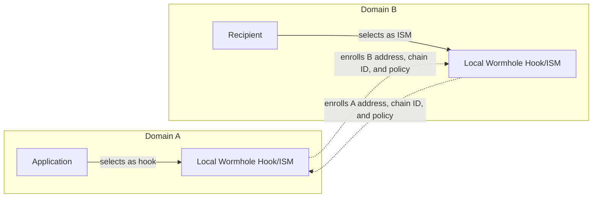
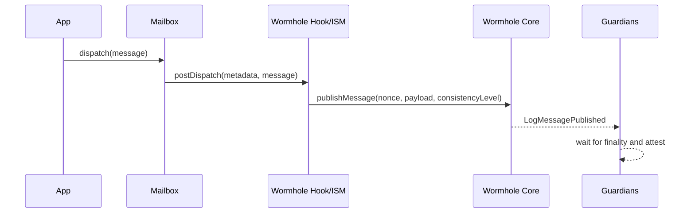
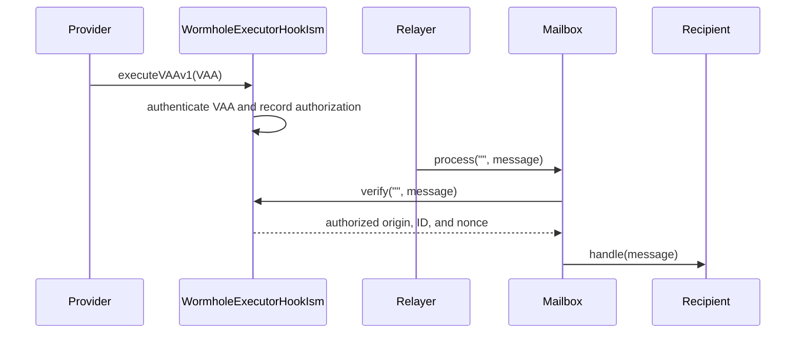
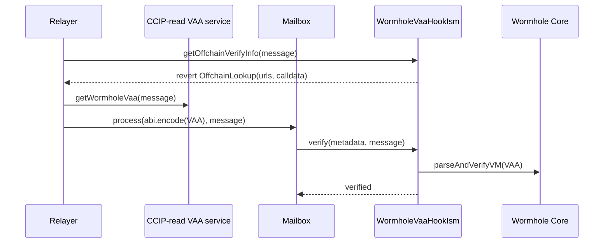
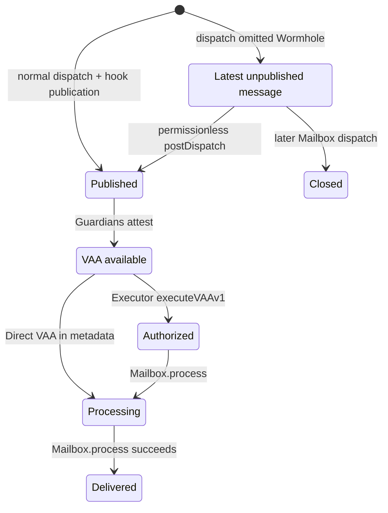

# Wormhole Hook/ISM

The Wormhole Hook/ISM uses Wormhole Guardian attestations to authenticate
Hyperlane messages. The typical symmetric topology deploys one contract per
participating chain and configures it as both:

- the origin application's post-dispatch hook; and
- the destination application's interchain security module (ISM).

Each deployment can serve multiple enrolled remote domains. Separate local
contracts can serve outbound and inbound roles when directional enrollment uses
their exact addresses, but they do not share configuration or state. The
implementation provides two VAA delivery options with the same publication
format and authentication policy.

“One per chain” means one per shared owner, remote-router set, finality policy,
and operational blast radius. Multiple applications can share a deployment only
when they accept that shared security configuration; isolated applications can
deploy separate instances.

| Contract | VAA delivery | Hyperlane ISM metadata |
| --- | --- | --- |
| [`WormholeExecutorHookIsm`](./WormholeExecutorHookIsm.sol) | A Wormhole Executor provider, or another caller, submits the VAA before `Mailbox.process` | Empty |
| [`WormholeVaaHookIsm`](./WormholeVaaHookIsm.sol) | The Hyperlane relayer obtains the VAA through CCIP-read and supplies it to `Mailbox.process` | ABI-encoded VAA |

[`AbstractWormholeHookIsm`](./AbstractWormholeHookIsm.sol) contains the shared
route configuration, publication, fee handling, and VAA authentication logic.

## Hyperlane integration

The Wormhole contract participates in two independent parts of a Hyperlane
message's lifecycle:

1. On the origin, the Mailbox normally calls it as a post-dispatch hook. This
   publishes a commitment to the Hyperlane message through Wormhole Core.
2. On the destination, the Mailbox calls it as the recipient's ISM. This checks
   that Wormhole authenticated the same Hyperlane message.

The application may select the Wormhole contract directly or through compatible
routing and aggregation contracts. If used directly as the recipient ISM,
Wormhole is the recipient's message-authentication policy. If included in an
aggregation ISM, Wormhole is one input to that aggregation policy.

On dispatch, the Mailbox runs its required-hook tree and either the hook supplied
by the caller or its default-hook tree. For automatic publication, the Wormhole
deployment must be invoked exactly once across those two trees. If the same
deployment is invoked twice, including through nested aggregation or routing,
the second call reverts with `MessageAlreadyPublished` and rolls back the
dispatch.

On delivery, the Mailbox first asks the recipient for
`interchainSecurityModule()` and falls back to its default ISM. A recipient with
a custom ISM therefore does not inherit a Wormhole default ISM unless its custom
policy includes Wormhole. An m-of-n aggregation can succeed without Wormhole
when its threshold is reachable using other modules. If Wormhole must be part of
the security policy, configure the threshold and module set so it cannot be
omitted.

For a route from domain A to domain B, the publishing contract on A must enroll
the verifying contract on B, and that B contract must enroll the A publisher.
These entries serve different checks: A uses its entry to target the publication
and B uses its entry to authenticate the emitter. In the typical symmetric
topology, the same two entries support traffic in both directions. Split-role
deployments require separate enrollment for each directional pair.



“Same contract as hook and ISM” describes the recommended shared local
deployment, not a protocol requirement that outbound and inbound roles use one
address. Deployments on A and B can also have different EVM addresses. Matching
variants should be used for each directional pair's normal automated delivery.

## Message flow

On the origin chain, both variants publish the dispatched Hyperlane message to
Wormhole Core:



The fixed-size Wormhole payload commits to:

- a protocol magic value and version;
- Hyperlane origin and destination domains;
- the destination Wormhole Hook/ISM address;
- the Hyperlane message ID; and
- the Hyperlane nonce.

The payload is defined in
[`WormholeMessage.sol`](../../libs/WormholeMessage.sol).

Publication does not itself deliver the Hyperlane message. It creates the
Wormhole event that Guardians observe and attest. A Hyperlane relayer must still
submit the original message to the destination Mailbox after the selected VAA
delivery path has made its authentication evidence available.

The hook accepts only the Mailbox's latest dispatched message and records every
published message ID. This binds normal publication to the Mailbox dispatch
flow and prevents the same Hook/ISM deployment from publishing one Hyperlane
message twice.

`postDispatch` is permissionless and does not require the Mailbox as caller. If
the Wormhole hook was omitted during dispatch, any caller with the message bytes
and required fees can publish that still-unpublished message while it remains
the Mailbox's latest dispatch. A later successful Mailbox dispatch closes this
rescue window. This path does not let the caller change the canonical Hyperlane
message, but applications should configure automatic hook execution instead of
relying on the timing-sensitive rescue path.

### Message identifiers and ordering

The Hyperlane message ID is the hash of the full packed message and is the main
authentication key. The Hyperlane `uint32` nonce is copied into both the payload
and the Wormhole VAA header so all three values must agree, but it does not force
messages to be delivered in order.

Wormhole Core independently assigns a `uint64` sequence per emitter. The hook
uses that sequence to identify the VAA and build an Executor request; it is not a
Hyperlane nonce or authorization key. The hook reads `nextSequence` before
publication and reverts the whole transaction if `publishMessage` returns a
different sequence.

### Executor variant

The origin hook also purchases delivery through the configured Executor Quoter
Router. A provider or rescuer submits the signed VAA to `executeVAAv1` on the
destination. The callback records an authorization keyed by origin domain and
message ID. A Hyperlane relayer can then process the message with empty ISM
metadata.



`executeVAAv1` is permissionless. The caller is not trusted for authenticity;
the VAA and enrolled route provide authentication. Before a callback succeeds,
provider failure or a reverted attempt can be rescued by any caller submitting
the valid VAA and paying the callback transaction's gas. A successful callback
consumes the Core VAA body digest and prevents another VAA from authorizing the
same origin-domain and message-ID pair.

The callback stores the authenticated Hyperlane nonce plus one under the origin
domain and message ID. It does not call `Mailbox.process`, and verification does
not consume this authorization. After callback success, retry the Hyperlane
delivery rather than `executeVAAv1`; the destination Mailbox supplies final
message replay protection.

### Direct-VAA variant

The destination ISM implements the existing EIP-3668 CCIP-read interface. Its
`getOffchainVerifyInfo(message)` call intentionally reverts with
`OffchainLookup`, which tells a compatible Hyperlane relayer which URLs and
calldata to use. The service returns the VAA, and the relayer passes the
ABI-encoded service response to `Mailbox.process`. The ISM verifies the VAA
through Wormhole Core in that same transaction.



The CCIP-read service transports data but is not trusted for authenticity.
Invalid, malformed, or mismatched VAAs revert during onchain verification. The
owner can configure one or more discovery URLs with `setUrls`. Endpoint failure
blocks automated lookup for relayers relying on that endpoint; another endpoint
or any independently obtained valid VAA can supply the same canonical metadata.

A compatible service must implement `getWormholeVaa(bytes message)`. A URL
containing `{data}` is queried with GET after substituting the ABI calldata; a
URL without it is queried with POST data containing at least `sender` and
`data`, with relayers able to include a request signature and origin transaction
hash. The HTTP response is JSON `{ "data": "0x..." }`, where `data` is the ABI
encoding of one dynamic `bytes` return value. It is not the raw VAA. A caller
supplying metadata directly must likewise use `abi.encode(encodedVaa)`.

Relayers try configured fallback URLs. They may cache `OffchainLookup` results
for a message, so an owner update through `setUrls` is not necessarily visible
until that cache expires or the relayer restarts.

### Choosing a variant

| Property | Executor | Direct VAA |
| --- | --- | --- |
| VAA reaches the destination | Before `Mailbox.process`, through `executeVAAv1` | In the `Mailbox.process` metadata |
| Destination state | Stores an authorization | No preauthorization state |
| ISM module type | `NULL` | `CCIP_READ` |
| Hyperlane ISM metadata | Empty | ABI-encoded return value of `getWormholeVaa(message)` |
| Wormhole-related origin fees | Core publication fee plus Executor quote | Core publication fee |
| Automated liveness dependencies | Guardians, configured Executor provider, and Hyperlane relayer | Guardians, CCIP-read endpoint, and CCIP-read-compatible Hyperlane relayer |
| Recovery from delivery-provider failure | Before authorization, any caller can submit the valid VAA to `executeVAAv1` | Use a fallback URL, wait for a URL-cache refresh, or supply canonical metadata obtained elsewhere |
| Guardian-set acceptance required until | `executeVAAv1` succeeds | `Mailbox.process` succeeds |

Choose Executor when preauthorization and empty Hyperlane metadata justify the
additional delivery request and fee. Choose Direct VAA when the relayer can
perform CCIP-read and atomic onchain VAA verification is preferred. Both use the
same Guardian authentication and payload binding.

## Configuration

Common constructor configuration includes the local Mailbox, Wormhole Core,
and publication consistency level. Construction verifies that Core is a
contract for the current EVM chain and reports a nonzero Wormhole chain ID.
The Mailbox, Core address, local Wormhole chain ID, and publication consistency
policy are immutable after deployment.

These constructor checks are sanity checks, not proofs that an address is an
official deployment. Deployment tooling and reviewers must confirm the canonical
Hyperlane Mailbox and its domain, Wormhole Core, Custom Consistency Level, and
Executor Quoter Router addresses for the chain. The Executor constructor checks
only that its Quoter Router has code; a route's `quoter` may be a
provider-controlled address and is checked only for nonzero.

Remote enrollment uses `RemoteRouterEnrollment` from
[`IWormholeHookIsm.sol`](../../interfaces/wormhole/IWormholeHookIsm.sol):

```solidity
struct RemoteRouterEnrollment {
    uint32 domain;
    bytes32 router;
    uint16 wormholeChainId;
    uint8 expectedConsistencyLevel;
}
```

The Executor variant additionally requires a nonzero quoter and callback gas
limit for each route. Its callback gas limit budgets `executeVAAv1`; it is not
the gas limit for the Hyperlane recipient's `handle` call. This enrolled value
is authoritative and cannot be overridden by per-dispatch hook metadata.

Enrollment rejects the local domain, the local or zero Wormhole chain ID, a zero
or noncanonical EVM router address, and reuse of one Wormhole chain ID by
multiple Hyperlane domains. The contract stores `expectedConsistencyLevel` as a
raw `uint8` without validating whether the remote deployment can emit it. The
owner must verify both that value and the remote address. Use the typed
enrollment functions on the concrete contracts; the inherited basic
`Router.enrollRemoteRouter(uint32,bytes32)` path is disabled because it cannot
install the required Wormhole policy.

Replacing a router while retaining its Wormhole chain ID is supported. Changing
the Wormhole chain ID requires unenrolling the domain first.

For traffic from A to B, verify the following configuration together:

1. A's required and selected/default hook trees invoke the A deployment exactly
   once.
2. A enrolls B's Hook/ISM address and Wormhole chain ID.
3. B's recipient selects the B deployment as its ISM, directly or through ISM
   composition.
4. B enrolls A's Hook/ISM address and Wormhole chain ID.
5. B's `expectedConsistencyLevel` for A equals A's immutable
   `consistencyLevel`.
6. For Executor delivery, A's B route has the intended quoter and enough
   callback gas to execute B's `executeVAAv1`.

### Consistency and finality

The publication consistency level tells Wormhole when a Core publication is
eligible for Guardian attestation. A stronger finality choice generally waits
longer before attestation and reduces exposure to origin-chain reorganization.
The precise finality semantics remain chain-specific Wormhole behavior.

The local publication constructor accepts Wormhole's EVM values:

| Value | Mode |
| --- | --- |
| `200` | Instant |
| `201` | Safe |
| `202` | Finalized |
| `203` | Custom |

Use the EVM-specific finalized value `202`. The pinned Wormhole SDK's generic
`CONSISTENCY_LEVEL_FINALIZED` constant is `1`; this implementation deliberately
rejects that value.

For custom mode, deployment must supply the applicable official per-chain Custom
Consistency Level contract, one standard base level, and an additional block
count. The constructor verifies that the address has code, registers the
configuration, and checks what the contract stored. It does not prove that the
address belongs to Wormhole.

The origin deployment publishes its immutable `consistencyLevel` in every VAA.
The destination stores an `expectedConsistencyLevel` for each enrolled origin
and requires exact equality. A mismatch does not invalidate Guardian signatures,
but this Hook/ISM rejects the VAA with `WrongConsistencyLevel`. Changing a
deployment's publication policy therefore requires a new deployment and a
coordinated remote-router update.

## Authentication

Destination verification delegates Guardian signature validation to the
configured Wormhole Core contract. It then requires:

1. the payload magic, version, and encoded length are valid;
2. the payload targets the local Hyperlane domain and local Hook/ISM address;
3. the VAA nonce equals the payload nonce;
4. the VAA emitter chain and address equal the enrolled origin route;
5. the VAA consistency level equals the enrolled expectation; and
6. the payload origin, destination, message ID, and nonce match the Hyperlane
   message.

The security boundary therefore includes Wormhole Core and its Guardian set,
the canonical Hyperlane Mailbox, the owner-controlled route configuration, and
the application's hook and ISM selection. Executors, CCIP-read services, and
Hyperlane relayers can delay or omit data but cannot make an invalid VAA satisfy
these checks.

| Component | Security role |
| --- | --- |
| Wormhole Core and Guardians | Establish whether the VAA has the required Guardian signatures |
| Hook/ISM owner | Selects trusted remote emitter addresses, chain IDs, consistency levels, and delivery configuration |
| Hyperlane Mailbox | Establishes the canonical message and message ID used by the hook and destination delivery |
| Application and Mailbox configuration | Ensure the Wormhole hook runs when required and the intended ISM policy runs on delivery |
| Executor provider or CCIP-read service | Supplies authenticated data; affects liveness but is not trusted to make a VAA valid |
| Hyperlane relayer | Submits the original Hyperlane message and metadata; cannot alter fields committed by the message ID |

Owner compromise is security-critical because enrolling an attacker-controlled
emitter makes that emitter trusted for the corresponding Hyperlane origin.
Application misconfiguration can omit Wormhole from one side of the flow.

A matching VAA proves that the enrolled remote Hook/ISM published the exact
Hyperlane message. It does not prove that the message's Hyperlane sender is an
application the recipient intended to authorize: any user can dispatch through
a canonical Mailbox and select a shared hook. The recipient must validate the
expected `(origin, sender)` in `handle`, as Hyperlane `Router` does, or impose an
equivalent application or ISM policy. Using this contract directly as the ISM
does not remove that recipient-level authorization requirement.

## Fees and metadata

There are two distinct Wormhole-related fees:

| Fee | Variants | What it pays for |
| --- | --- | --- |
| Wormhole Core `messageFee()` | Executor and Direct VAA | Publishing the message through the origin chain's Wormhole Core contract |
| Executor delivery quote | Executor only | Asking the configured Executor provider to submit the Wormhole callback on the destination chain |

The Core fee is not a direct payment to individual Guardians for their
signatures. Guardians observe messages accepted and emitted by Wormhole Core,
then attest them according to the Wormhole protocol. Wormhole Core may configure
its publication fee to zero or a nonzero native-token amount. When nonzero,
`publishMessage` requires that amount; without a successful publication there
is no Wormhole event for Guardians to attest. The hook therefore reads
`messageFee()` for every quote and forwards that exact amount to
`publishMessage`. Paying it does not select Guardians, change the signature
threshold, or reduce the configured consistency level.

The Executor fee is separate from attestation. The hook obtains it from
`executorQuoterRouter.quoteExecution` and forwards it to `requestExecution`.
It funds delivery of the VAA to the destination Hook/ISM using the configured
provider and callback gas limit. The Direct VAA variant omits this fee because a
Hyperlane relayer supplies the VAA during verification instead.

Both fees use native tokens in this version. They are also separate from the
origin transaction's gas and any other Hyperlane hook or relayer costs. The
contracts reject fee-token metadata and nonzero destination `msg.value`.
Excess payment is refunded using standard Hyperlane hook metadata.

All hooks in a standard aggregation receive the same fee-token metadata.
Consequently, a tree containing this native-only hook cannot also use a nonzero
ERC-20 fee token for another child such as an IGP; the Wormhole hook rejects the
shared metadata.

Call the Mailbox's `quoteDispatch` immediately before dispatch so the result
includes its required hook and the selected hook or hook aggregation. The Core
and Executor amounts are read again during `postDispatch`, so a fee increase
between quoting and execution can make the dispatch revert for underpayment. A
decrease becomes excess payment and is refunded to the metadata refund address.
If a nonzero refund is due and that address rejects native currency, the refund
reverts and rolls back the publication and Executor request. Use a refund
address that can receive the origin chain's native token.

## Message and route lifecycle

In the normal configured-hook path, origin dispatch and Wormhole publication are
atomic. If fee payment, `publishMessage`, the Executor request, or an excess-fee
refund fails, the entire Mailbox dispatch reverts. Permissionless rescue
publication happens in a later transaction and cannot roll back the earlier
Mailbox dispatch. After publication, Guardian attestation and destination
processing are asynchronous.



The destination Mailbox prevents a delivered message ID from being processed
again. A callback attempt that reverts before storing authorization, or a
reverted `Mailbox.process` transaction, rolls back its state and permits another
attempt. Transient finality, transport, endpoint, or provider failures can
recover through waiting or retry. A malformed or mismatched VAA remains invalid;
retry requires corrected evidence or compatible route policy. After Executor
authorization succeeds, retry `Mailbox.process`, not the consumed VAA callback.

Core must still accept the VAA's Guardian set when onchain validation occurs. A
Guardian-set expiry or rotation can therefore strand a delayed VAA. The Executor
variant has this exposure until `executeVAAv1` stores authorization; Direct VAA
has it until `Mailbox.process` succeeds. Stored Executor authorization survives
later Guardian-set and route changes. Recovery before authorization depends on
Wormhole making an acceptable VAA available; this contract has no signature
bypass.

Route changes affect in-flight messages according to their stage:

| Stage | Effect of route removal or replacement |
| --- | --- |
| Before origin dispatch | The old route cannot publish; a replacement route is used by later dispatches |
| Published but not authenticated on the destination | The payload keeps the destination address selected at publication; changing that address does not rewrite the VAA |
| Executor VAA not yet submitted | Destination enrollment must still authenticate the VAA's original emitter and target |
| Executor authorization stored | Later unenrollment does not revoke the stored authorization; `Mailbox.process` can still succeed |
| Direct VAA awaiting `Mailbox.process` | Destination enrollment must remain compatible until the processing transaction verifies the VAA |
| Delivered by the Mailbox | Route changes do not alter Mailbox delivery state |

### Route removal

`unenrollRemoteRouter` and `unenrollRemoteRouters` remove the router, Wormhole
policy, reverse chain-ID index, and any Executor delivery configuration. Each
removal emits `WormholeRemoteRouterUnenrolled` with the domain, removed router,
and Wormhole chain ID.

Removal prevents new publications to the route and new destination
authentication from that remote router. Existing Executor authorizations remain
valid so an already-authenticated Hyperlane message can still be retried.

Replacing a remote router under the same Wormhole chain ID takes effect
immediately. A VAA emitted by the previous router will no longer pass destination
emitter authentication unless its Executor authorization was already stored.
Changing the chain ID uses explicit unenrollment first so the reverse chain-ID
index cannot retain a stale association.

## Observability

The following events identify where a message or configuration change reached:

| Event | Meaning |
| --- | --- |
| Mailbox `DispatchId` | The origin Mailbox emitted the Hyperlane message ID |
| Wormhole Core `LogMessagePublished` | Core accepted the publication and assigned its sequence |
| `WormholeMessagePublished` | The Hook/ISM completed Core publication and, for Executor, requested delivery |
| `MessageAuthorized` | The Executor variant accepted the VAA on the destination |
| Mailbox `ProcessId` | Destination ISM verification and recipient handling completed successfully |
| `WormholeRemoteRouterEnrolled` / `WormholeRemoteRouterUnenrolled` | Owner changed the route authentication policy |
| `ExecutorConfigSet` / `UrlsChanged` | Owner changed the selected variant's delivery configuration |

A successful dispatch receipt containing `DispatchId` but no
`WormholeMessagePublished` shows that this deployment was not invoked by either
hook tree in that transaction. A later permissionless rescue publication can
emit `WormholeMessagePublished` in a separate transaction. Publication without
an observed VAA may involve finality, Guardian liveness, VAA API availability,
indexing, or monitoring. For Executor, a VAA without `MessageAuthorized` points
to submission or callback failure; authorization without `ProcessId` points to
Hyperlane delivery or recipient execution. For Direct VAA, publication without
`ProcessId` may involve VAA availability, CCIP lookup, verification, Hyperlane
delivery, or recipient execution.

## Operational constraints

- The implementation supports EVM origins and destinations.
- A bidirectional application should select the same local deployment as its
  outbound hook and inbound ISM. Addresses may differ across chains.
- Matching variants are expected at both route endpoints for automated
  delivery.
- Wormhole delivery does not use Hyperlane `Router.handle`; that entrypoint is
  intentionally unsupported.
- Executor authorizations do not expire and cannot be individually revoked.
  Mailbox delivery state prevents their reuse for a second delivery.
- Guardian/Core availability, Executor availability, and CCIP-read availability
  remain liveness dependencies according to the selected variant.
- Route owners must validate Wormhole chain IDs, remote addresses, consistency
  levels, and Executor configuration before enrollment.
