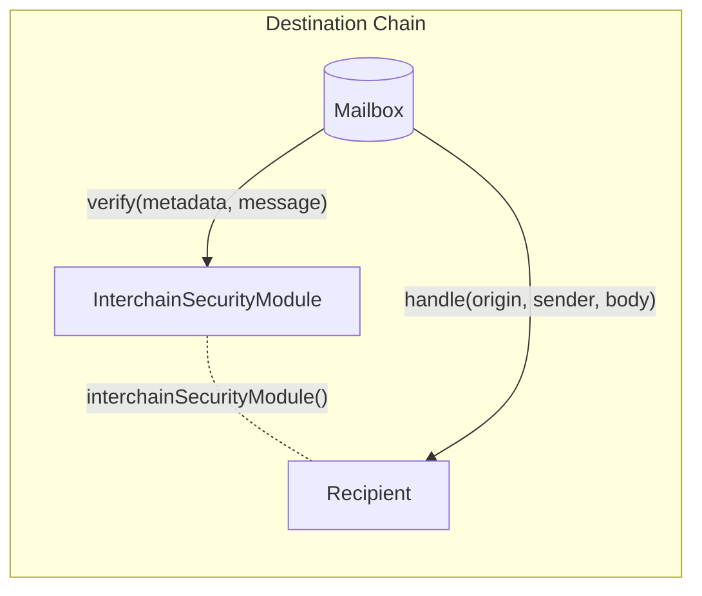

# Interchain Security Modules

Interchain security modules allow developers to configure additional security checks for message content dispatched via the Mailbox.

> [!WARNING]
> Interchain security modules may be replayable. Developers creating custom modules should include replay protection if necessary. [Here](./warp-route/RateLimitedIsm.sol#L23) is an example implementation.
