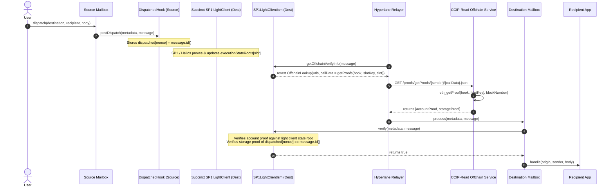

# Succinct Telepathy / SP1 LightClient ISM for Hyperlane

This directory contains the smart contracts for verifying Hyperlane messages across EVM chains using Succinct's Telepathy / SP1 Light Client and CCIP-Read (ERC-3668) storage proofs.

## Overview

Telepathy / SP1 is Succinct's protocol for verifying Ethereum's light client protocol in a zkSNARK. The Telepathy light client on a destination chain tracks Ethereum beacon chain slots and provides the corresponding execution state roots (`executionStateRoots[slot]`).

Using Hyperlane's modular security architecture and ERC-3668 (CCIP-Read), this ISM allows trust-minimized, zero-knowledge verified cross-chain message passing without requiring any modifications to the Hyperlane offchain relayer.

## Architecture



## Smart Contracts

- [`DispatchedHook.sol`](../hooks/DispatchedHook.sol): Deployed on the source chain (e.g. Ethereum / Holesky). Emitted messages have their `message.id()` indexed by `message.nonce()` in a storage mapping: `dispatched[nonce] = message.id()`.
- [`ISP1LightClient.sol`](../../interfaces/ISP1LightClient.sol): Interface for Succinct's light client contract, exposing `head()` and `executionStateRoots(slot)`.
- [`ISuccinctProofsService.sol`](../../interfaces/ccip-gateways/ISuccinctProofsService.sol): Interface specifying the CCIP-Read offchain RPC lookup format `getProofs(target, storageKey, slot)`.
- [`StateProofHelpers.sol`](../../libs/StateProofHelpers.sol): Library implementing MPT and RLP verification to verify Ethereum state roots and storage proofs.
- [`StorageProofIsm.sol`](./StorageProofIsm.sol): Abstract CCIP-Read ISM implementing storage proof verification and slot calculations.
- [`SP1LightClientIsm.sol`](./SP1LightClientIsm.sol): Concrete ISM reading finalized execution state roots from the on-chain SP1 Light Client.

---

## Deployment & Configuration Guide

### 1. Deploying Succinct Telepathy Light Client on Any EVM Chain

1. Clone Succinct's Telepathy / SP1 Helios repository:
   ```bash
   git clone https://github.com/succinctlabs/sp1-helios.git
   cd sp1-helios
   ```
2. Deploy the `LightClient.sol` contract to your target destination EVM chain using Foundry or Hardhat with the initial trusted checkpoint (beacon block root, genesis validators root, slot):
   ```bash
   forge create contracts/src/LightClient.sol:LightClient \
     --rpc-url <DESTINATION_RPC_URL> \
     --private-key <DEPLOYER_PRIVATE_KEY> \
     --constructor-args <GENESIS_VALIDATORS_ROOT> <GENESIS_TIME> <SECONDS_PER_SLOT> <SLOTS_PER_PERIOD> <PERIOD> <POSEIDON_COMMITMENT> <SOURCE_CHAIN_ID> <FINALITY_THRESHOLD>
   ```
3. Run the SP1 Helios relayer daemon or Succinct platform operator to regularly post zero-knowledge proofs updating the LightClient contract's head and execution state roots.

---

### 2. Deploying DispatchedHook on Source Chain

Deploy `DispatchedHook` to the source chain (e.g. Ethereum / Holesky):
```bash
forge create contracts/hooks/DispatchedHook.sol:DispatchedHook \
  --rpc-url <SOURCE_RPC_URL> \
  --private-key <DEPLOYER_PRIVATE_KEY>
```
Initialize the contract and optionally set a dispatch fee via `setDispatchFee(uint256)`.

---

### 3. Deploying SP1LightClientIsm on Destination Chain

Deploy `SP1LightClientIsm` to the destination chain (e.g. Base Sepolia):
```bash
forge create contracts/isms/ccip-read/SP1LightClientIsm.sol:SP1LightClientIsm \
  --rpc-url <DESTINATION_RPC_URL> \
  --private-key <DEPLOYER_PRIVATE_KEY>
```
Initialize the ISM with the destination Mailbox, source DispatchedHook, destination LightClient, the dispatched slot index (`0`), and offchain CCIP server URLs:
```solidity
sp1LightClientIsm.initialize(
    destinationMailboxAddress,
    sourceDispatchedHookAddress,
    destinationLightClientAddress,
    0, // dispatched mapping storage slot
    offchainGatewayUrls
);
```

---

### 4. Running the CCIP-Read Offchain Proof Service

In `typescript/ccip-server`:
1. Configure environment variables:
   ```env
   ENABLED_MODULES="proofs"
   RPC_ADDRESS="https://ethereum-holesky-rpc.publicnode.com"
   CONSENSUS_API_URL="https://ethereum-holesky-beacon-api.publicnode.com/eth/v2/beacon/blocks"
   SERVER_PORT=3000
   ```
2. Start the service:
   ```bash
   pnpm --filter @hyperlane-xyz/ccip-server dev
   ```

---

## Testnet Deployment Verification Evidence

Testnet deployment between Holesky (Source) and Base Sepolia (Destination):

| Contract | Network | Address |
|---|---|---|
| **SP1LightClientISM** | Base Sepolia | [`0xc93cF66649631303b70b7640Fbe4aaE667d93475`](https://sepolia.basescan.org/address/0xc93cF66649631303b70b7640Fbe4aaE667d93475) |
| **SP1LightClient** | Base Sepolia | [`0x2241db9AE432C0f7DE41f88f2f28dF1242bF0315`](https://sepolia.basescan.org/address/0x2241db9AE432C0f7DE41f88f2f28dF1242bF0315) |
| **DispatchedHook / Native** | Holesky | [`0x720127655fbb415C4c289C2462c8096f38ABD4cC`](https://holesky.etherscan.io/address/0x720127655fbb415C4c289C2462c8096f38ABD4cC) |
| **Synthetic Token / Recipient** | Base Sepolia | [`0x828616Ac3CFaCB309862d19625b5d7AA02e620E1`](https://sepolia.basescan.org/address/0x828616Ac3CFaCB309862d19625b5d7AA02e620E1) |
