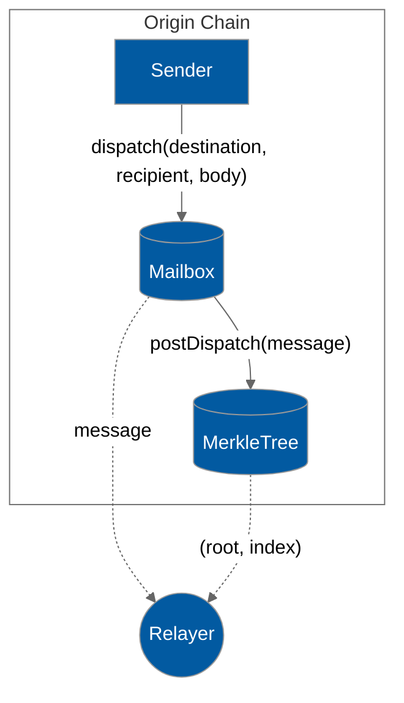
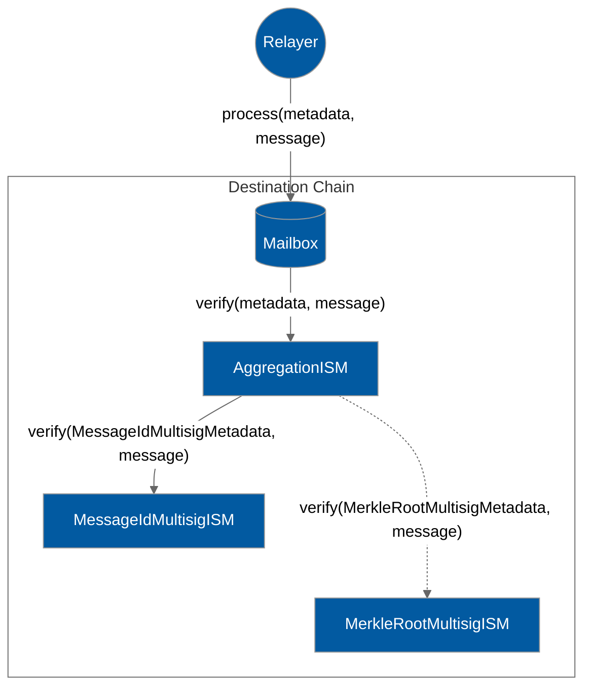

Moving the MerkleTree out of the Mailbox into a Hook makes outbound storage modular. However, we can no longer assume that the message nonce is the same as the MerkleTree index.

Validators attest to the content of the MerkleTree and produce signatures on (leaf, root, index) checkpoints. To ensure checkpoint uniqueness, the origin domain and MerkleTree address are included as domain separators. The Multisig ISM variants require a quorum of signatures on a checkpoint from the configured validator set.

The MessageIdMultisigIsm checks if the message ID matches the checkpoint leaf. To compute the checkpoint digest, the relayer must provide the (root, index) as metadata, and the contract must compute the leaf from the message ID.

```solidity
struct MessageIdMultisigMetadata {
  bytes32 merkleTree;
  bytes32 root;
  uint32 index;
  Signature[] signatures;
}

```

The MerkleRootMultisigIsm uses a merkle proof to check if the message ID is contained in the checkpoint root. This ensures "all-or-nothing" censorship resistance -- a quorum on the latest checkpoint can be used to verify all historical messages in the MerkleTree. To compute the checkpoint digest, the relayer must provide the (messageId, proof, messageIndex, rootIndex) as metadata, and the contract must compute the root from the proof of messageIndex

```solidity
struct MerkleRootMultisigMetadata {
  bytes32 merkleTree;
  uint32 messageIdIndex;
  bytes32[32] proof;
  uint32 computedRootIndex;
  Signature[] signatures;
}

```


