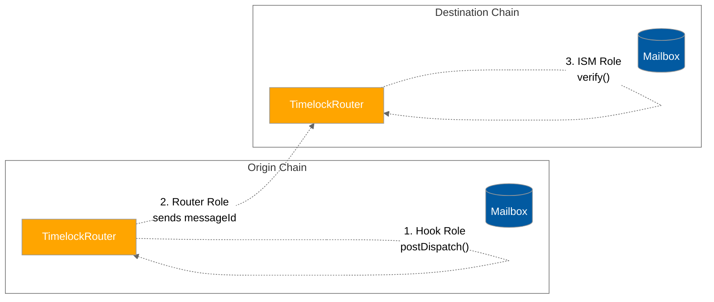
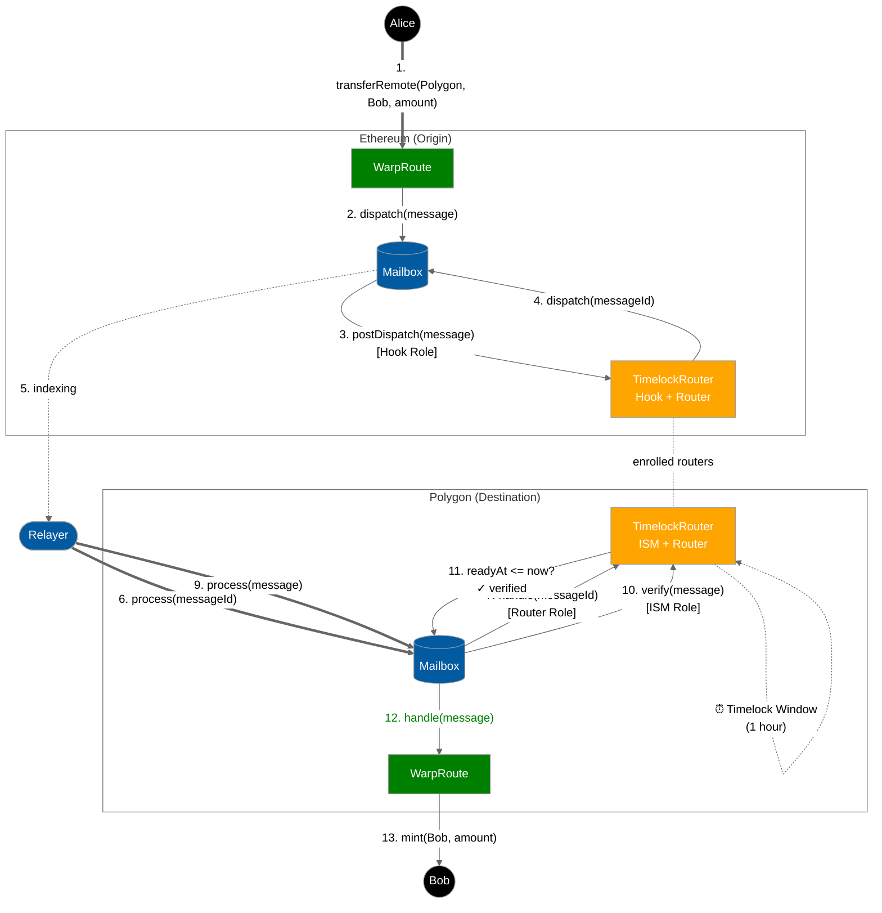
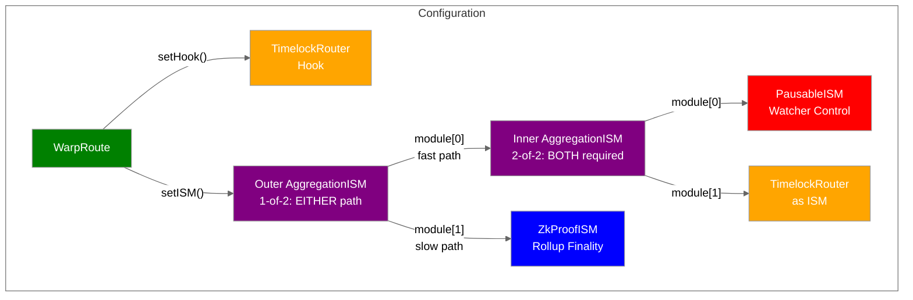
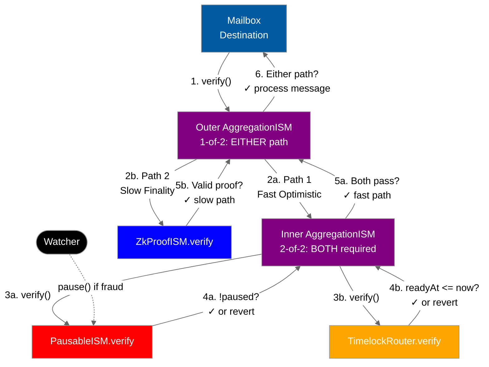
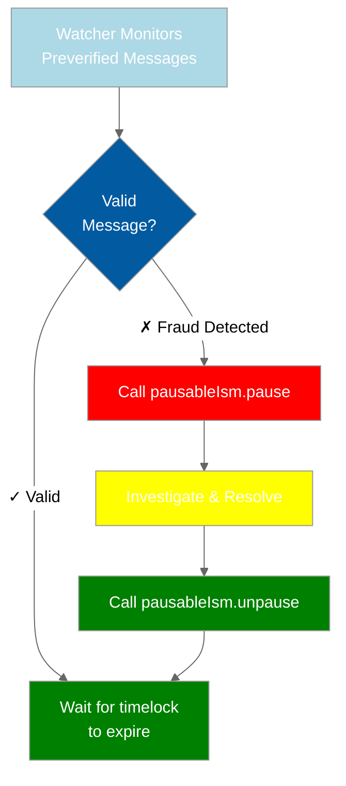
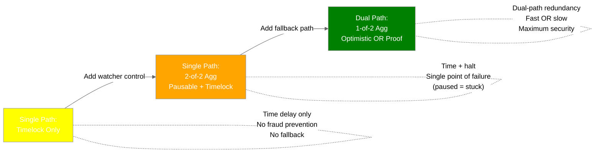
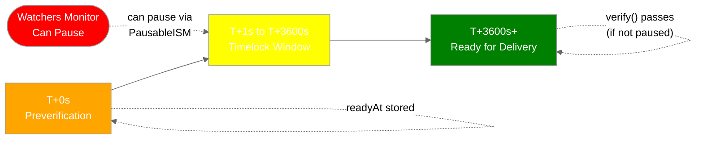
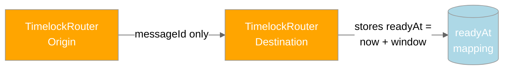
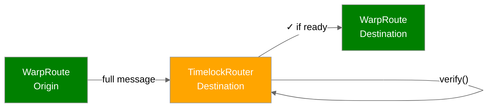
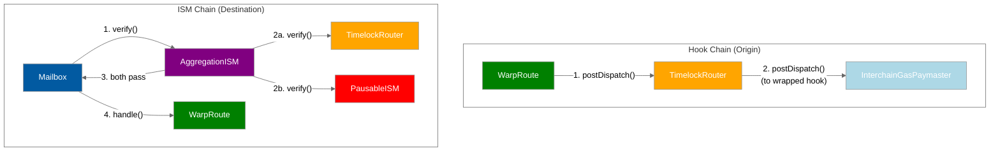

# TimelockRouter with WarpRoute - Message Lifecycle

This document illustrates the complete message lifecycle when a WarpRoute uses TimelockRouter as both its hook and ISM.

## What is TimelockRouter?

**TimelockRouter** is a pure timelock mechanism - it delays message processing by a fixed time window. This provides time for off-chain observation, but does NOT inherently provide fraud proofs or pausing.

**To create true optimistic security with watcher/fraud proof capabilities, aggregate TimelockRouter with PausableISM** (see section below).

## Basic Configuration (Timelock Only)

```solidity
// On both origin and destination chains:
WarpRoute warpRoute;
TimelockRouter timelockRouter;

// Configure WarpRoute to use TimelockRouter
warpRoute.setHook(address(timelockRouter));
warpRoute.setInterchainSecurityModule(address(timelockRouter));
```

## TimelockRouter Architecture

TimelockRouter serves three roles in the message lifecycle:



## Transfer Alice's tokens from Ethereum to Bob on Polygon

This flow shows how TimelockRouter handles both preverification and actual message delivery.



## Creating Optimistic Security via Threshold Aggregation

TimelockRouter alone only provides a time delay. To create true optimistic security with **fraud proofs and watcher-based pausing**, aggregate it with **PausableISM** and a **finality proof system** using **threshold-based aggregation**:

**Structure**: 1-of-2 aggregation of [2-of-2 aggregation of (pausable + timelock), finality proof]

This provides **two independent paths** to message finality:

- **Fast optimistic path**: Requires BOTH pausable AND timelock (2-of-2)
- **Slow finality path**: Requires only cryptographic proof (bypasses optimistic layer)



### Deployment Code

```solidity
// 1. Deploy base components
TimelockRouter timelockRouter = new TimelockRouter(mailbox, 1 hours);
PausableIsm pausableIsm = new PausableIsm(watcherAddress);
ZkProofIsm zkProofIsm = new ZkProofIsm(...); // or RollupIsm, any finality ISM

// 2. Inner aggregation (2-of-2): BOTH pausable AND timelock must pass
address[] memory innerModules = new address[](2);
innerModules[0] = address(pausableIsm);      // Must not be paused
innerModules[1] = address(timelockRouter);   // Must pass timelock
StaticAggregationIsm innerAgg = new StaticAggregationIsm(innerModules, 2);

// 3. Outer aggregation (1-of-2): EITHER optimistic path OR finality proof
address[] memory outerModules = new address[](2);
outerModules[0] = address(innerAgg);         // Fast optimistic path
outerModules[1] = address(zkProofIsm);       // Slow finality path
StaticAggregationIsm optimisticIsm = new StaticAggregationIsm(outerModules, 1);

// 4. Configure WarpRoute
warpRoute.setHook(address(timelockRouter));
warpRoute.setInterchainSecurityModule(address(optimisticIsm));
```

### How Dual-Path Optimistic Security Works



**Verification Flow:**

**Path 1 (Fast Optimistic)**: Inner aggregation passes if BOTH conditions met:

- `PausableISM.verify()` passes (not paused)
- `TimelockRouter.verify()` passes (timelock expired)
- Result: Message delivered after timelock, unless paused by watcher

**Path 2 (Slow Finality)**: Bypass optimistic layer entirely:

- `ZkProofISM.verify()` passes (valid ZK proof of rollup finality)
- Result: Message delivered immediately with cryptographic proof

**Outer aggregation** (1-of-2 threshold): Message passes if EITHER path succeeds

**Benefits:**

- Normal case: Fast optimistic path (low cost, 1 hour latency)
- Emergency case: Slow finality path bypasses paused optimistic layer
- Redundancy: Two independent security mechanisms

### Watcher Workflow



**Watcher Actions:**

1. **Monitor**: Watch for `MessageQueued` events from TimelockRouter
2. **Validate**: Check if message is valid (e.g., verify merkle proofs, check balances)
3. **Pause if Invalid**: If fraud detected, call `pausableIsm.pause()`
   - Paused messages CANNOT be processed (PausableISM.verify reverts)
   - Gives time to investigate and resolve
4. **Unpause**: After resolution, call `pausableIsm.unpause()`

## Complete Optimistic System: Dual-Path Architecture

For maximum security with optimistic assumptions, use **dual-path threshold aggregation**: `1-of-2 aggregation of [2-of-2 aggregation of (pausable + timelock), finality proof]`

This provides two independent paths to finality, mirroring optimistic rollup architecture.


### Deployment: Complete Optimistic System

```solidity
// 1. Deploy all components
TimelockRouter timelockRouter = new TimelockRouter(mailbox, 1 hours);
PausableIsm pausableIsm = new PausableIsm(watcherAddress);
ZkProofIsm zkProofIsm = new ZkProofIsm(...); // or RollupIsm, any finality ISM

// 2. Inner aggregation (2-of-2): BOTH pausable AND timelock must pass
address[] memory innerModules = new address[](2);
innerModules[0] = address(pausableIsm);      // Must not be paused
innerModules[1] = address(timelockRouter);   // Must pass timelock
StaticAggregationIsm innerAgg = new StaticAggregationIsm(innerModules, 2);

// 3. Outer aggregation (1-of-2): EITHER optimistic path OR finality proof
address[] memory outerModules = new address[](2);
outerModules[0] = address(innerAgg);         // Fast optimistic path
outerModules[1] = address(zkProofIsm);       // Slow finality path
StaticAggregationIsm optimisticIsm = new StaticAggregationIsm(outerModules, 1);

// 4. Configure WarpRoute
warpRoute.setHook(address(timelockRouter));
warpRoute.setInterchainSecurityModule(address(optimisticIsm));
```

### Why Dual-Path Architecture?

This mirrors optimistic rollup architecture with two independent verification paths:

**Path 1: Fast Optimistic (Inner 2-of-2 Aggregation)**

1. **PausableISM** = Fraud proof submission capability

   - Watchers can immediately halt suspicious messages
   - Provides emergency brake during investigation

2. **TimelockRouter** = Challenge period
   - Fixed time window for fraud detection
   - Prevents instant finality, allows observation

**Path 2: Slow Finality (Cryptographic Proof)** 3. **ZkProofISM/RollupISM** = Finality verification

- Cryptographic proof that message is valid (ZK proof, multisig, etc.)
- Bypasses optimistic layer entirely
- Fallback when optimistic path is paused or untrusted

**Security Trade-offs:**



**When to Use Each:**

- **Timelock only**: Low-value transfers, trusted environment, minimal security needs
- **2-of-2 Agg (Pausable + Timelock)**: Medium security with watcher control, but vulnerable to permanent pause
- **1-of-2 Dual-Path**: Maximum security with redundancy - optimistic path can be paused without breaking the system

## Timelock Security Timeline



## Two Messages Per Transfer

The TimelockRouter sends **two messages** for each token transfer:

### Message 1: Preverification Message (Steps 4-8)



**Purpose**: Notify destination that a message is coming and start the timelock timer.

**Payload**: `abi.encode(messageId)` - just the message ID, not the full message

**Handler**: `TimelockRouter.handle()` stores `readyAt[messageId] = block.timestamp + timelockWindow`

### Message 2: Actual Transfer Message (Steps 9-13)



**Purpose**: The actual token transfer message.

**Payload**: `TokenMessage` containing recipient, amount, etc.

**Verifier**: `TimelockRouter.verify()` checks `readyAt[messageId] <= block.timestamp`

**Handler**: `WarpRoute.handle()` processes the transfer

## Security Comparison

| Security Model                             | Components                   | Time Delay     | Fraud Prevention         | Cryptographic Proof  | Redundancy    | Security Level |
| ------------------------------------------ | ---------------------------- | -------------- | ------------------------ | -------------------- | ------------- | -------------- |
| **TimelockRouter only**                    | 1 ISM                        | ✓ Yes          | ✗ No                     | ✗ No                 | ✗ Single path | Low            |
| **2-of-2 Agg (Pausable + Timelock)**       | 2 ISMs (both required)       | ✓ Yes          | ✓ Watcher pause          | ✗ No                 | ✗ Single path | Medium         |
| **ZkProofISM only**                        | 1 ISM                        | ✗ No           | N/A                      | ✓ ZK Proof           | ✗ Single path | Medium         |
| **1-of-2 Dual-Path (Optimistic OR Proof)** | 3 ISMs (nested, either path) | ✓ Yes (Path 1) | ✓ Watcher pause (Path 1) | ✓ ZK/Rollup (Path 2) | ✓ Two paths   | **Maximum**    |

**Key Insights**:

- **TimelockRouter** = Time delay building block
- **PausableISM** = Fraud prevention building block
- **ZkProofISM/RollupISM** = Cryptographic verification building block (ZK proofs, multisig, etc.)
- **2-of-2 Aggregation** = Single optimistic path (BOTH pausable AND timelock required)
- **1-of-2 Aggregation** = Dual-path redundancy (EITHER optimistic OR proof succeeds)
- **Complete Optimistic System** = 1-of-2 aggregation providing two independent paths to finality

## Hook and ISM Chaining

TimelockRouter can wrap other hooks and ISMs via MailboxClient inheritance:



## Gas Cost Comparison

| Security Model                | Messages | Origin Cost | Destination Cost          | Latency     |
| ----------------------------- | -------- | ----------- | ------------------------- | ----------- |
| No ISM                        | 1        | Low         | Low                       | ~Minutes    |
| ZkProofISM                    | 1        | Medium      | High (proof verification) | ~Minutes    |
| **TimelockRouter only**       | **2**    | **Medium**  | **Medium**                | **~1 hour** |
| **Timelock + Pausable**       | **2**    | **Medium**  | **Medium**                | **~1 hour** |
| Timelock + Pausable + ZkProof | 2        | High        | Very High                 | ~1 hour     |

**Trade-offs**:

- TimelockRouter: Higher latency but no proof verification costs
- Best for non-urgent transfers where time-based security is acceptable
- Add PausableISM for watcher control without increasing gas costs
- Can combine with ZkProofISM/RollupISM for maximum security

## Implementation Details

**Storage**:

```solidity
mapping(bytes32 => uint48) public readyAt;
```

**Preverification** (in `handle()`):

```solidity
readyAt[messageId] = uint48(block.timestamp) + timelockWindow;
emit MessageQueued(messageId, readyAt[messageId]);
```

**Verification** (in `verify()`):

```solidity
uint48 messageReadyAt = readyAt[messageId];
require(messageReadyAt > 0, "not preverified");
require(messageReadyAt <= block.timestamp, "not ready");
return true;
```
