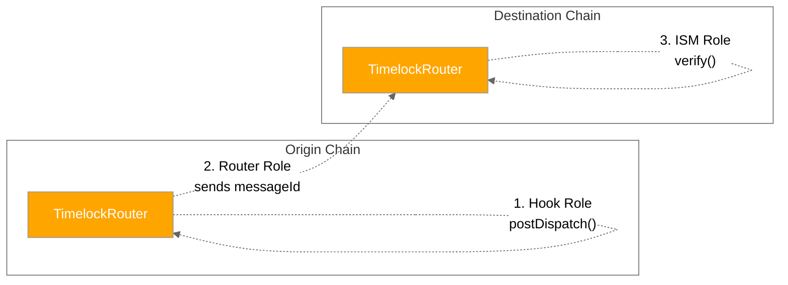
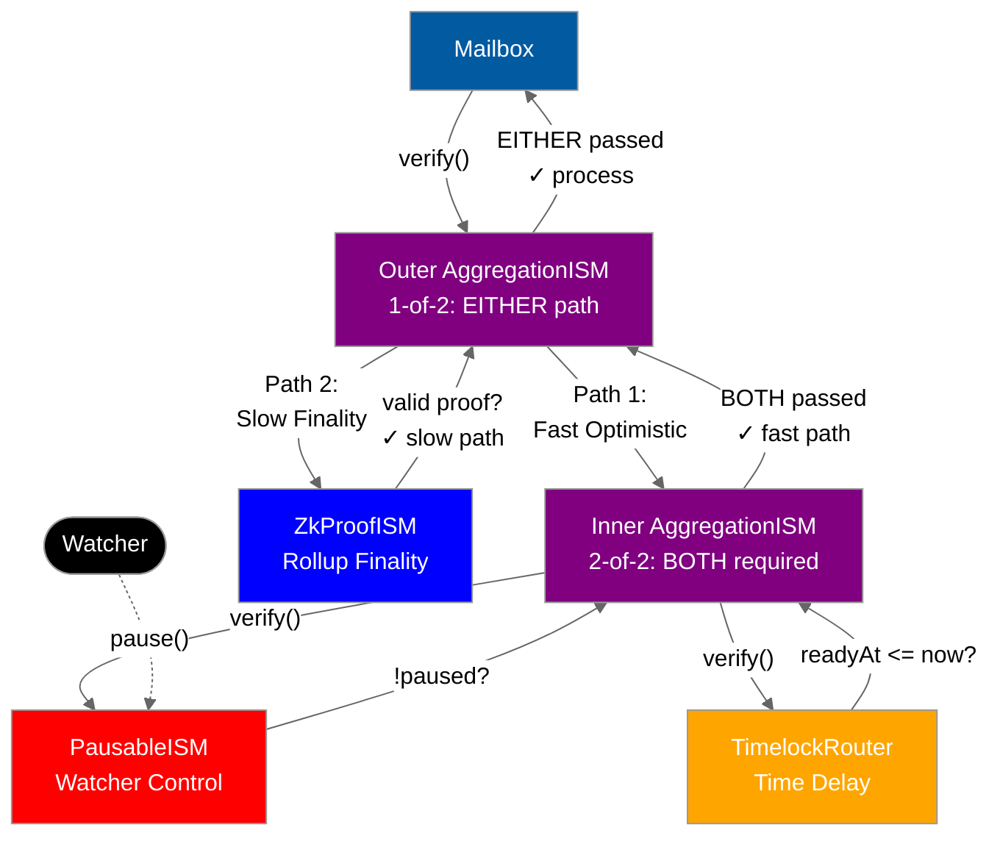

# TimelockRouter

TimelockRouter is a timelock mechanism that delays message processing by a fixed time window. It provides time for off-chain observation and watcher intervention, but does not inherently provide fraud proofs or pausing capabilities.

## 1. Timelock Architecture

TimelockRouter serves **three roles** in the message lifecycle:



**How it works:**

1. **Hook Role (Origin)**: When a message is dispatched, TimelockRouter sends a preverification message containing only the messageId to the destination chain
2. **Router Role (Destination)**: Receives the preverification message via `handle()` and stores `readyAt[messageId] = block.timestamp + timelockWindow`
3. **ISM Role (Destination)**: When the actual message arrives, `verify()` checks that `readyAt[messageId] <= block.timestamp` before allowing processing

**Two messages per transfer:**

- **Message 1 (Preverification)**: Sends messageId to destination, starts timelock timer
- **Message 2 (Actual Message)**: Delivers after timelock expires, verified by ISM

**Storage:**

```solidity
mapping(bytes32 => uint48) public readyAt;
uint48 public immutable timelockWindow;
```

## 2. WarpRoute with Timelock

Configure WarpRoute to use TimelockRouter as both hook and ISM:

```solidity
warpRoute.setHook(address(timelockRouter));
warpRoute.setInterchainSecurityModule(address(timelockRouter));
```

**Complete message flow:**


## 3. Optimistic Security with Aggregation

TimelockRouter alone provides time delay. To create **optimistic security with fraud proofs and watcher control**, aggregate it with PausableISM and a finality proof system using **threshold-based aggregation**.

**Architecture**: 1-of-2 aggregation of [2-of-2 aggregation of (pausable + timelock), finality proof]

This provides **two independent paths** to message finality:

- **Fast optimistic path** (Path 1): Requires BOTH pausable AND timelock (2-of-2 aggregation)
- **Slow finality path** (Path 2): Requires only cryptographic proof, bypasses optimistic layer



**Verification flow:**

**Path 1 (Fast Optimistic)**: Inner 2-of-2 aggregation requires BOTH:

- `PausableISM.verify()` passes (not paused by watcher)
- `TimelockRouter.verify()` passes (timelock expired)
- **Result**: Message delivered after timelock window, unless paused

**Path 2 (Slow Finality)**: Bypass optimistic layer entirely:

- `ZkProofISM.verify()` passes (valid ZK proof or cryptographic finality)
- **Result**: Message delivered immediately with cryptographic proof

**Outer 1-of-2 aggregation**: Message succeeds if EITHER path passes

**Benefits:**

- **Normal case**: Fast optimistic path (low cost, ~1 hour latency)
- **Emergency case**: Slow finality path bypasses paused optimistic layer
- **Redundancy**: Two independent security mechanisms

**Watcher workflow:**

1. **Monitor**: Watch for `MessageQueued` events from TimelockRouter
2. **Validate**: Check if message is valid (verify proofs, check state consistency)
3. **Pause if fraud detected**: Call `pausableIsm.pause()` to halt message processing
4. **Investigate & resolve**: Fix issues, then call `pausableIsm.unpause()`

**Security comparison:**

| Security Model                             | Time Delay | Fraud Prevention    | Cryptographic Proof | Redundancy      | Security Level |
| ------------------------------------------ | ---------- | ------------------- | ------------------- | --------------- | -------------- |
| TimelockRouter only                        | ✓          | ✗                   | ✗                   | ✗ Single path   | Low            |
| 2-of-2 Agg (Pausable + Timelock)           | ✓          | ✓ Watcher pause     | ✗                   | ✗ Single path   | Medium         |
| ZkProofISM only                            | ✗          | N/A                 | ✓                   | ✗ Single path   | Medium         |
| **1-of-2 Dual-Path (Optimistic OR Proof)** | **✓**      | **✓ Watcher pause** | **✓**               | **✓ Two paths** | **Maximum**    |

**Key insights:**

- **TimelockRouter** = Time delay building block
- **PausableISM** = Fraud prevention building block
- **ZkProofISM/RollupISM** = Cryptographic verification building block
- **Complete optimistic system** = 1-of-2 aggregation providing dual-path redundancy
