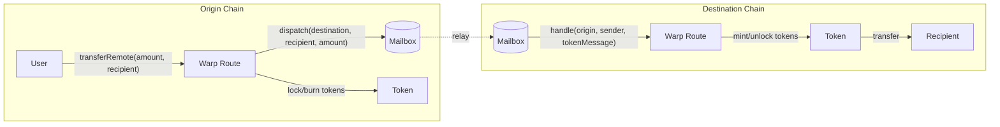

```mermaid
flowchart LR
    subgraph Origin Chain
      User
      WR_O[Warp Route]
      M_O[(Mailbox)]
      Token_O[Token]

      User -- "transferRemote(amount, recipient)" --> WR_O
      WR_O -- "lock/burn tokens" --> Token_O
      WR_O -- "dispatch(destination, recipient, amount)" --> M_O
    end

    subgraph Destination Chain
      Recipient[Recipient]
      WR_D[Warp Route]
      M_D[(Mailbox)]
      Token_D[Token]

      M_D -- "handle(origin, sender, tokenMessage)" --> WR_D
      WR_D -- "mint/unlock tokens" --> Token_D
      Token_D -- "transfer" --> Recipient
    end

    M_O -. "relay" .-> M_D
```
