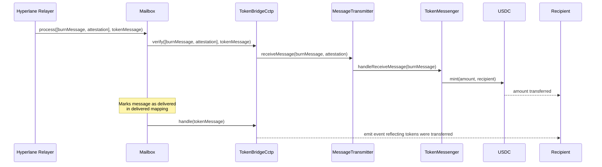
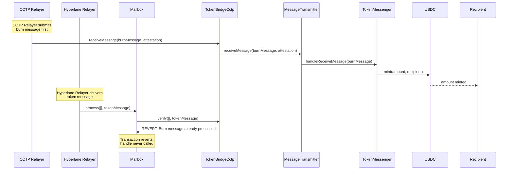
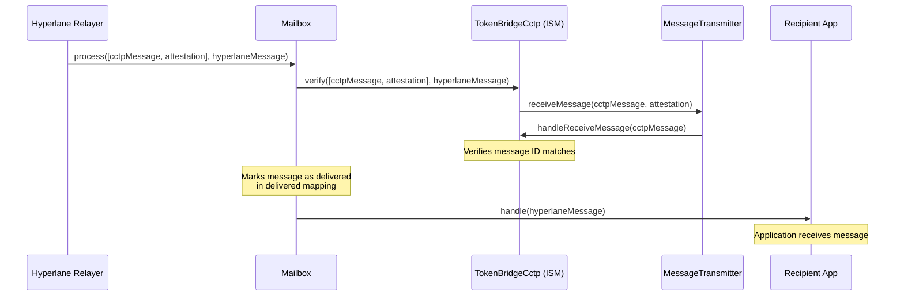
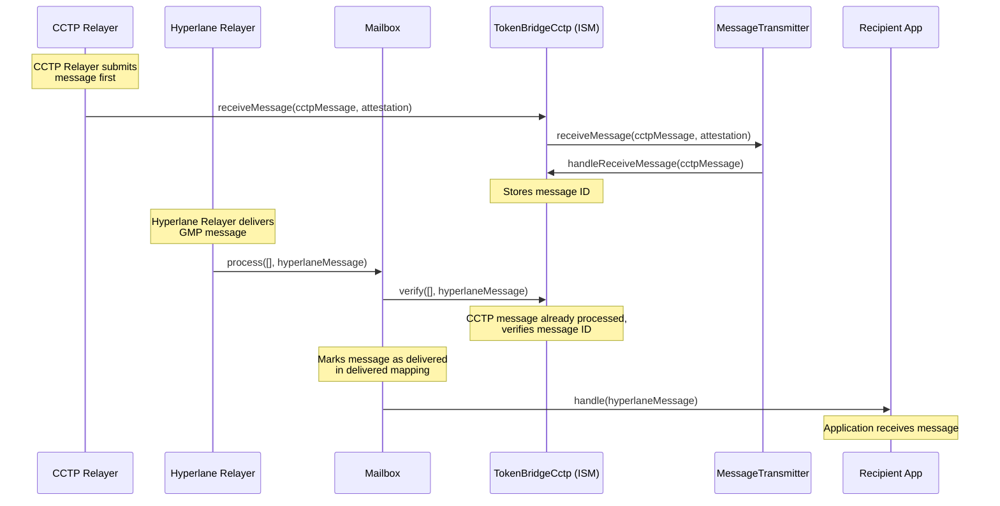

## Burn Message

```mermaid
flowchart LR
    Iris((Iris))
    Relayer((Relayer))

    subgraph Origin Chain
      User
      TBCCTP_O[TokenBridgeCctp]
      M_O[(Mailbox)]
      TM_O[TokenMessenger]
      MT_O[MessageTransmitter]
      USDC_O[USDC]

      User -- "transferRemote(amount, recipient)" --> TBCCTP_O
      TBCCTP_O -- "depositForBurn()" --> TM_O
      TM_O -- "burn" --> USDC_O
      User -. "amount" .-> USDC_O
      TM_O -- "sendMessage(burnMessage)" --> MT_O
      TBCCTP_O -- "dispatch(tokenMessage)" --> M_O
    end

    subgraph Destination Chain
      Recipient[Recipient]
      TBCCTP_D[TokenBridgeCctp]
      M_D[(Mailbox)]
      TM_D[TokenMessenger]
      MT_D[MessageTransmitter]
      USDC_D[USDC]

      TBCCTP_D -- "receiveMessage(
        burnMessage,
        attestation)" --> MT_D
      MT_D -- "burnMessage" --> TM_D
      TM_D -- "mint" --> USDC_D
      USDC_D -. "amount" .-> Recipient
    end

    M_O -. "tokenMessage" .-> Relayer
    Relayer -- "getOffchainVerifyInfo(tokenMessage)" --> TBCCTP_D
    TBCCTP_D -. "OffchainLookup" .-> Iris
    Iris -. "burnMessage, attestation" .-> Relayer

    Relayer -- "process(
    [burnMessage, attestation],
    tokenMessage)" --> M_D

    M_D -- "verify([burnMessage, attestation], tokenMessage)" --> TBCCTP_D
    M_D -- "handle(tokenMessage)" --> TBCCTP_D

    MT_O -. "burnMessage" .-> Iris

    classDef cctp fill:#e3f2fd
    classDef hyperlane fill:#f3e5f5
    class MT_O,MT_D,TM_O,TM_D,Iris,USDC_O,USDC_D cctp
    class M_O,M_D,Relayer hyperlane
```

## Hook Message

```mermaid
flowchart LR
    Iris((Iris))
    Relayer((Relayer))

    subgraph Origin Chain
      App
      M_O[(Mailbox)]
      TBCCTP_O[TokenBridgeCctp]
      MT_O[MessageTransmitter]

      App -- "dispatch(hyperlaneMessage)" --> M_O
      M_O -- "postDispatch(hyperlaneMessage)" --> TBCCTP_O
      TBCCTP_O -- "sendMessage(hyperlaneMessage.id())" --> MT_O
    end

    subgraph Destination Chain
      Recipient[Recipient]
      TBCCTP_D[TokenBridgeCctp]
      M_D[(Mailbox)]
      MT_D[MessageTransmitter]

      TBCCTP_D -- "receiveMessage(
        cctpMessage,
        attestation)" --> MT_D
      MT_D -- "handleReceiveMessage(cctpMessage)" --> TBCCTP_D
    end

    M_O -. "hyperlaneMessage" .-> Relayer
    TBCCTP_D -. "interchainSecurityModule()" .- Recipient
    TBCCTP_D -. "OffchainLookup" .-> Iris
    Iris -. "cctpMessage, attestation" .-> Relayer

    Relayer -- "getOffchainVerifyInfo(hyperlaneMessage)" --> TBCCTP_D
    Relayer -- "process(
    [cctpMessage, attestation],
    hyperlaneMessage)" --> M_D

    M_D -- "verify([cctpMessage, attestation], hyperlaneMessage)" --> TBCCTP_D
    M_D -- "handle(hyperlaneMessage)" ----> Recipient

    MT_O -. "cctpMessage" .-> Iris

    classDef cctp fill:#e3f2fd
    classDef hyperlane fill:#f3e5f5
    class MT_O,MT_D,TM_O,TM_D,Iris,USDC_O,USDC_D cctp
    class M_O,M_D,Relayer hyperlane
```

## Destination Chain Sequence Diagrams

### 1. Token Message with Hyperlane Relayer

### 2. Token Message with CCTP Relayer and Hyperlane Relayer

### 3. GMP Message with Hyperlane Relayer

### 4. GMP Message with CCTP Relayer and Hyperlane Relayer

