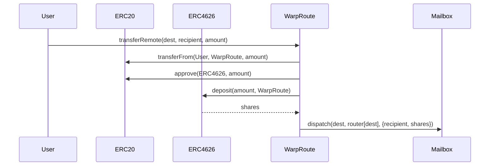
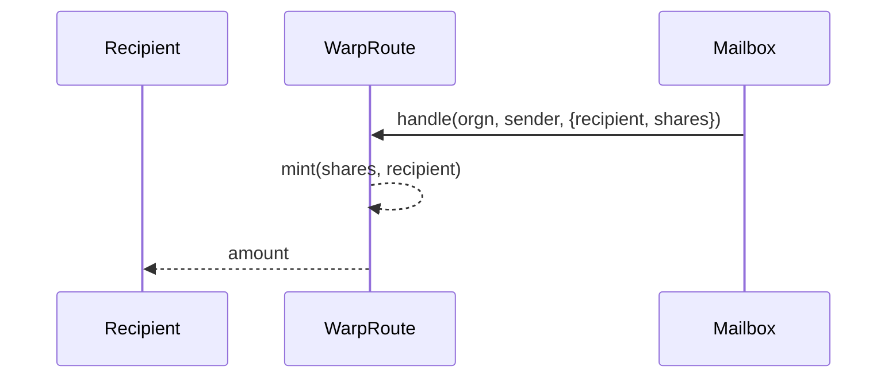
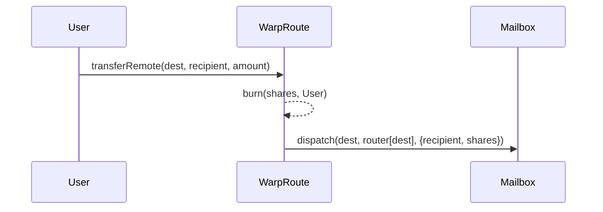
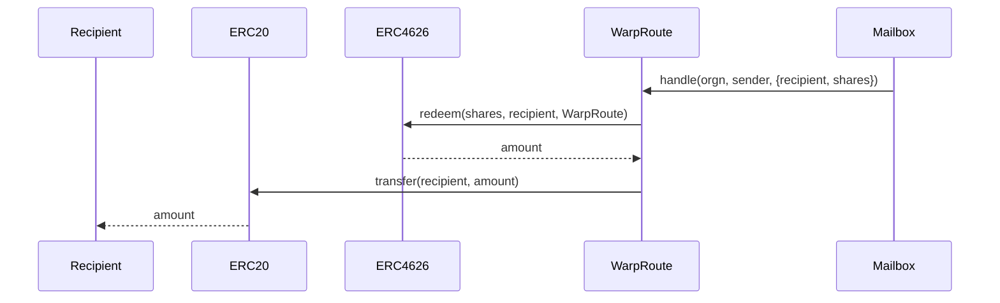

## `HypERC4626Collateral.transferRemote`

```mermaid
sequenceDiagram
    participant User
    participant ERC20
    participant ERC4626
    participant WarpRoute
    participant Mailbox

    User->>WarpRoute: transferRemote(dest, recipient, amount)
    WarpRoute->>ERC20: transferFrom(User, WarpRoute, amount)
    WarpRoute->>ERC20: approve(ERC4626, amount)
    WarpRoute->>ERC4626: deposit(amount, WarpRoute)
    ERC4626-->>WarpRoute: shares

    WarpRoute->>Mailbox: dispatch(dest, router[dest], {recipient, shares})
```

## `HypERC4626.handle`

```mermaid
sequenceDiagram
    participant Recipient
    participant WarpRoute
    participant Mailbox

    Mailbox->>WarpRoute: handle(orgn, sender, {recipient, shares})
    WarpRoute-->>WarpRoute: mint(shares, recipient)
    WarpRoute-->>Recipient: amount
```

## `HypERC4626.transferRemote`

```mermaid
sequenceDiagram
    participant User
    participant WarpRoute
    participant Mailbox

    User->>WarpRoute: transferRemote(dest, recipient, amount)
    WarpRoute-->>WarpRoute: burn(shares, User)
    WarpRoute->>Mailbox: dispatch(dest, router[dest], {recipient, shares})
```

## `HypERC4626Collateral.handle`

```mermaid
sequenceDiagram
    participant Recipient
    participant ERC20
    participant ERC4626
    participant WarpRoute
    participant Mailbox

    Mailbox->>WarpRoute: handle(orgn, sender, {recipient, shares})
    WarpRoute->>ERC4626: redeem(shares, recipient, WarpRoute)
    ERC4626-->>WarpRoute: amount
    WarpRoute->>ERC20: transfer(recipient, amount)
    ERC20-->>Recipient: amount
```
