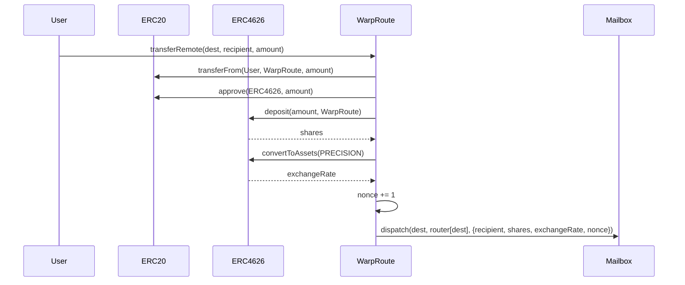
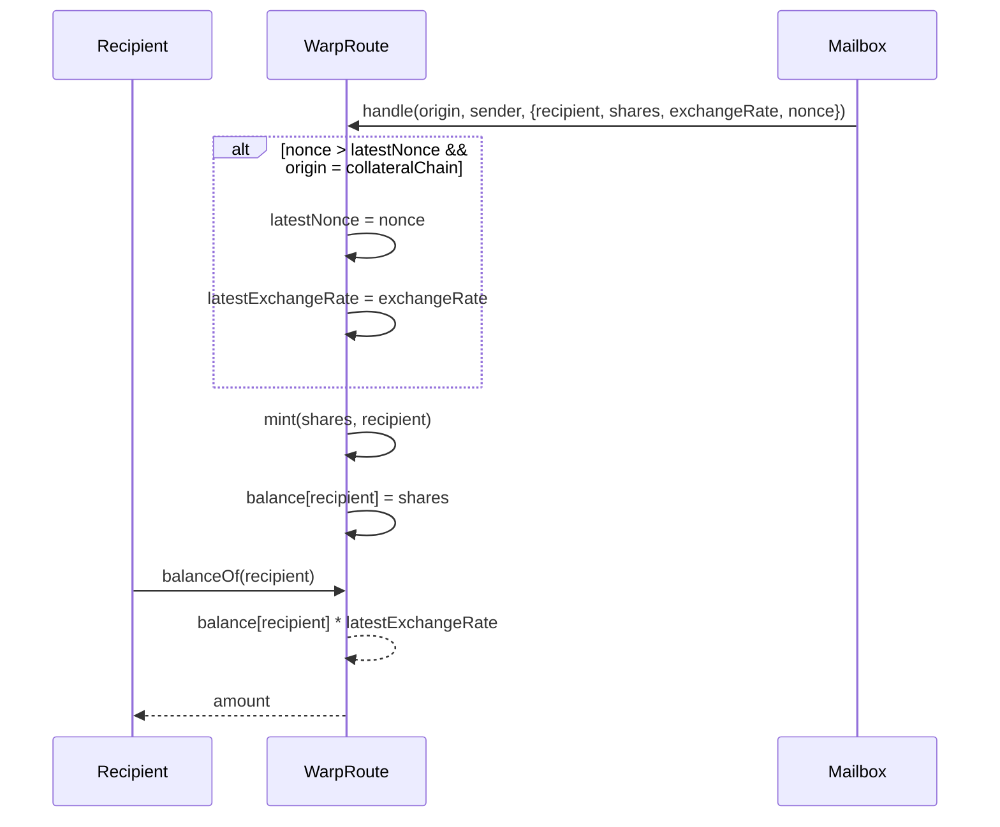
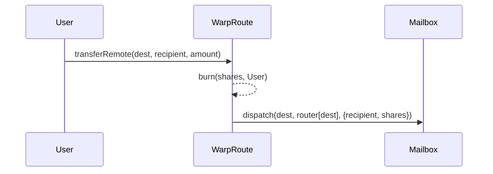
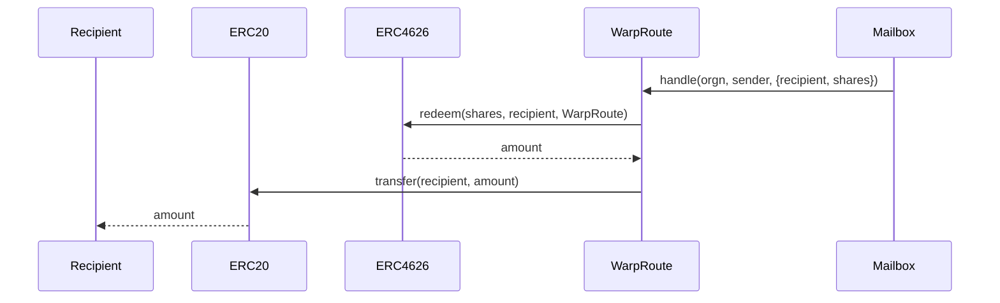

# Yield Routes

Yield routes are a mechanism to transfer yield-bearing assets across chains using the ERC4626 standard.

`HypERC4626Collateral` is a contract that implements `ERC4626` deposits upon transfer and withdrawal upon transfer back.

`HypERC4646` is a contract that implements a rebasing `ERC20`. Balances are virtualized as vault shares times the total assets over the total shares in the `ERC4626` vault (on the collateral chain).

## `HypERC4626Collateral.transferRemote`

## `HypERC4626.handle`

## `HypERC4626.transferRemote`

## `HypERC4626Collateral.handle`

