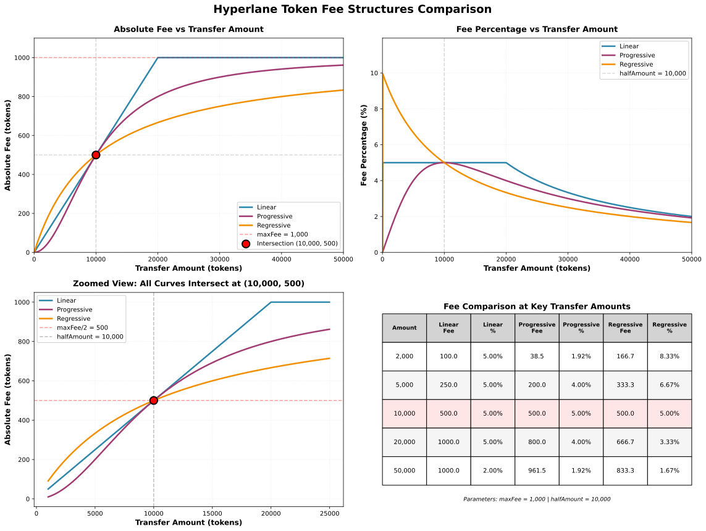

# Hyperlane Token Fee Structures

This directory implements four distinct fee models for cross-chain token transfers, plus a routing mechanism. All models share a common base architecture and parameters.

## Visual Comparison



_Comprehensive comparison of all three fee models showing absolute fees, fee percentages, zoomed intersection view, and numerical comparison table. Generated using `visualize_fees.py`._

### 🎮 Interactive Explorer

Explore fee curves interactively with adjustable parameters using the Jupyter notebook:

**Option 1: Run in Browser (No Installation)**

- [](https://mybinder.org/v2/gh/hyperlane-xyz/hyperlane-monorepo/fee-notebook?labpath=solidity%2Fcontracts%2Ftoken%2Ffees%2Ffee_explorer.ipynb) - Click to launch in Binder
- [](https://colab.research.google.com/github/hyperlane-xyz/hyperlane-monorepo/blob/fee-notebook/solidity/contracts/token/fees/fee_explorer.ipynb) - Click to open in Google Colab

**Option 2: Run Locally**

```bash
# Install dependencies
pip install -r requirements.txt

# Launch Jupyter
jupyter notebook fee_explorer.ipynb
```

**Features:**

- 🎛️ Adjustable sliders for `maxFee`, `halfAmount`, and current transfer amount
- 📊 Real-time curve updates as you adjust parameters
- 📈 Live fee calculations and comparison table
- 🎯 Visual indicators showing current transfer amount on curves

## Architecture Overview

### BaseFee (BaseFee.sol:19)

Abstract base contract that defines the common structure for all fee implementations:

**Key Parameters:**

- `token` - The ERC20 token for which fees apply (immutable)
- `maxFee` - Maximum fee that can be charged in token units (immutable)
- `halfAmount` - Reference amount where fee equals maxFee/2 (immutable)

**Common Features:**

- Owner can claim accumulated fees via `claim()`
- Implements `ITokenFee` interface
- Returns fees as `Quote[]` array for cross-chain transfers

---

## Fee Models

### 1. Linear Fee (LinearFee.sol)

**Formula:**

```
fee = min(maxFee, (amount × maxFee) / (2 × halfAmount))
```

**Characteristics:**

- Simple linear growth until reaching cap
- Fee reaches `maxFee` at `amount = 2 × halfAmount`
- Most predictable and straightforward model

**Example** (maxFee = 10, halfAmount = 1000):
| Amount | Fee | Fee % |
|--------|-----|-------|
| 500 | 2.5 | 0.5% |
| 1,000 | 5 | 0.5% |
| 2,000 | 10 | 0.5% |
| 4,000 | 10 | 0.25% (capped) |

---

### 2. Progressive Fee (ProgressiveFee.sol)

**Formula:**

```
fee = (maxFee × amount²) / (halfAmount² + amount²)
```

**Characteristics:**

- Fee **percentage** increases up to `halfAmount`, then decreases
- Absolute fee approaches but never reaches `maxFee`
- Creates a "hump" in the fee percentage curve
- Encourages mid-sized transfers

**Example** (maxFee = 1000, halfAmount = 10000):
| Amount | Fee | Fee % |
|---------|-------|--------|
| 2,000 | 38.5 | 1.92% |
| 5,000 | 200 | 4.00% |
| 10,000 | 500 | 5.00% (peak %) |
| 20,000 | 800 | 4.00% |
| 50,000 | 961.5 | 1.92% |

---

### 3. Regressive Fee (RegressiveFee.sol)

**Formula:**

```
fee = (maxFee × amount) / (halfAmount + amount)
```

**Characteristics:**

- Fee **percentage** continuously decreases as amount increases
- Absolute fee approaches but never reaches `maxFee`
- Most favorable for large transfers ("whale-friendly")
- Penalizes small transfers with higher effective rates

**Example** (maxFee = 1000, halfAmount = 5000):
| Amount | Fee | Fee % |
|---------|-------|--------|
| 1,000 | 166.7 | 16.67% |
| 5,000 | 500 | 10.00% |
| 10,000 | 666.7 | 6.67% |
| 20,000 | 800 | 4.00% |
| 50,000 | 909.1 | 1.82% |

---

### 4. Routing Fee (RoutingFee.sol)

**Purpose:** Meta-fee contract that delegates to destination-specific fee contracts

**Characteristics:**

- Maintains `mapping(uint32 destination => address feeContract)`
- Delegates `quoteTransferRemote()` to configured contracts
- Returns empty quotes for unconfigured destinations
- Allows different fee models per destination chain

**Use Case:**

```solidity
// Example: Different fee structures for different chains
// Ethereum → Arbitrum: Use Linear fee
// Ethereum → Optimism: Use Regressive fee
// Ethereum → Polygon: Use Progressive fee
// Ethereum → Base: No fee (not configured)
```

---

## Key Insights

### Intersection Point

All three mathematical models (Linear, Progressive, Regressive) intersect at:

```
amount = halfAmount
fee = maxFee / 2
```

### Comparison Summary

| Model           | Best For                | Fee % Trend                    | Reaches maxFee?       |
| --------------- | ----------------------- | ------------------------------ | --------------------- |
| **Linear**      | Predictability          | Constant until cap, then ↓     | Yes (at 2×halfAmount) |
| **Progressive** | Mid-size transfers      | ↑ then ↓ (peaks at halfAmount) | No (asymptotic)       |
| **Regressive**  | Large transfers         | Continuously ↓                 | No (asymptotic)       |
| **Routing**     | Multi-chain flexibility | Depends on delegate            | Depends on delegate   |

### Economic Incentives

**Linear:**

- Neutral - treats all amounts proportionally until cap
- Simple for users to calculate expected fees

**Progressive:**

- Discourages both very small and very large transfers
- Optimal transfer size is around `halfAmount`
- Creates a "sweet spot" for transfer amounts

**Regressive:**

- Strongly encourages consolidation into larger transfers
- Penalizes small retail transfers
- Whale-friendly, favors institutional flows

**Routing:**

- Flexible - can optimize per destination
- Example: Use Linear for L2s (low gas), Progressive for expensive chains

---

## Implementation Notes

### Fee Type Enum (BaseFee.sol:11)

```solidity
enum FeeType {
  ZERO, // 0 - No fees
  LINEAR, // 1
  REGRESSIVE, // 2
  PROGRESSIVE, // 3
  ROUTING // 4
}
```

### Safety Features

- All constructors validate `maxFee > 0` and `halfAmount > 0`
- Owner cannot be zero address
- Integer division always rounds down (favors user)
- RoutingFee accepts `type(uint256).max` for both params (not used in calculations)

### Gas Considerations

- **Linear:** Most gas-efficient (simple division)
- **Regressive:** Moderate gas (one division)
- **Progressive:** Highest gas cost (two squaring operations)
- **Routing:** Base cost + delegated contract cost

---

## Generating Custom Visualizations

Use the included Python script to generate fee curve visualizations with custom parameters:

```bash
# Setup (first time only)
python3 -m venv .venv
source .venv/bin/activate
pip install numpy matplotlib

# Generate with default parameters (maxFee=1000, halfAmount=10000)
python visualize_fees.py

# Generate with custom parameters
python visualize_fees.py --maxfee 100 --halfamount 5000 --maxamount 25000

# Custom output filename
python visualize_fees.py --output my_custom_curves
```

**Available Options:**

- `--maxfee`: Maximum fee in token units (default: 1000)
- `--halfamount`: Amount at which fee equals maxFee/2 (default: 10000)
- `--maxamount`: Maximum amount to visualize on x-axis (default: 50000)
- `--output`: Output file prefix without extension (default: fee_curves)

The script generates SVG format for maximum compatibility and scalability.
